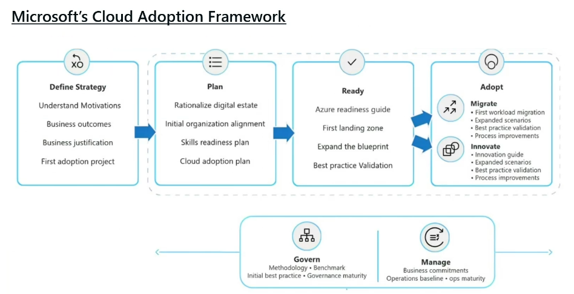

# AZ-305 - Day 0 (Orientation)
**Instructor:** Greg Lojek
 
**MS Teams Meeting link:** https://tinyurl.com/368f25nz
 
 
**Lessons start time:** 08:00

1 Hour 30 for 50~ questions
You do have access to Microsoft Learn but this will eat into your times

## Course Overview
65% crossover with AZ-104

Comes at it from a different perspective. Rather than knowing the details its more about knowing the different features and options 

## Course Content

## Exam Breakdown
- Time: 1 Hour, 40 Mins
- No. of Questions 50~

## Case Studies

## Microsoft Cloud Adoption Framework for Azure

### Very Important Links
[Microsoft Cloud Adoption Framework for Azure](https://learn.microsoft.com/en-us/azure/cloud-adoption-framework/)

[Azure Architecture Center](https://learn.microsoft.com/en-us/azure/architecture/)

## Labs (Go Deploy)

- **Link:** https://fb.labsonline.it/
- **Login:** james.a.calder@outlook.com

5 attempts on each lab
Labs sessions are active for an hour, you will be prompted when the session nears its end, you can extend a session by 15 mins if you need more time (this can only be done once)

You can not save the lab you either have to finish it or abandon it.

If your VM does not have internet access you can reset the gateway from the lightning button options

Enhance session mode alow for screen resolution adjustments

### Lab Guide
- Can be detached and moved to an additional screen with the detach button
- Text in green will paste the value of the link in the machine
- Mark where you are in the guide with the tick boxes so that should the session restart you know where you were.
- If you need to paste data from outside the session into a the session you can do so by going to: `Home Tab > Tools Section > Paste Button`

[Microsoft Presented Course Using Same Slides can be found here](https://learn.microsoft.com/en-us/shows/on-demand-instructor-led-training-series/)