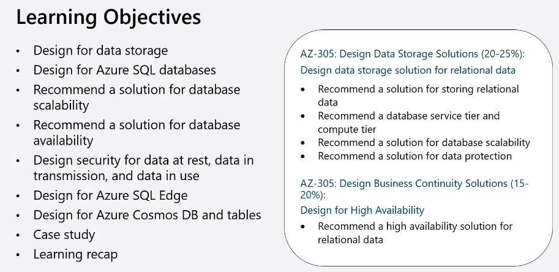
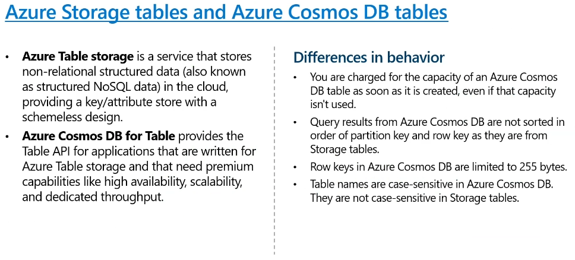

# AZ-305 - Day 1 (Subject)
## Design a Governance Solution
### Objectives

### Govern resources in Azure
Governance provides mechanisms and processes to maintain control over your applications and resources in Azure

[Azure Management Areas 📎](https://learn.microsoft.com/en-us/azure/governance/management-groups/azure-management)

### Plan your management groups
Management groups manage access, Policy and compliance subscriptions

- Keep the management group hierarchy reasonably flat
- Consider a top-level management group
- Consider an organisational or departmental structure
- Consider a geographical structure
- Consider a production management group
- Consider a sandbox management group
- Consider isolating sensitive information in a separate management group

**You can have 6 levels in your hierarchy (7 if you include the top Tenant root management group which can not be changed)**

**You have to explicitly add/elevate a Global Administrators access to be able to see other management groups.**

[Elevate access to manage all Azure subscriptions and management groups 📎](https://learn.microsoft.com/en-us/azure/role-based-access-control/elevate-access-global-admin?tabs=azure-portal)

### Design for multiple subscriptions
Azure subscriptions are logical containers for management and billing.
- Align you subscriptions with the business needs and priorities - consider billing and cost reporting
- Consider administrative management - centralised or decentralised
- Group subscriptions together under management groups - apply common policies and role assignments.
- Consider subscription scale limits - specialised workloads, UoT, SAP
- Consider a dedicated shared services subscription - common services everyone shares
- make subscription owners aware of their riles and responsibilities

#### Useful Links
[Azure Charts, Useful for seeing SLAs by service, Regions etc... 📎](https://azurecharts.com/)

[Azure Speed - Nice site for working out latencies will be between regions 📎](https://www.azurespeed.com/Azure/Latency)

[Region To Region Latency Chart 📎](https://www.azurespeed.com/Azure/RegionToRegionLatency)

[Azure Live Service Status portal 📎](https://azure.status.microsoft/en-us/status)

[Subscription considerations and recommendations 📎](https://learn.microsoft.com/en-us/azure/cloud-adoption-framework/ready/landing-zone/design-area/resource-org-subscriptions)

[Azure subscription and service limits, quotas, and constraints 📎](https://learn.microsoft.com/en-us/azure/azure-resource-manager/management/azure-subscription-service-limits)

### When to use subscriptions - example
- Secure workloads that require additional policies and role-based access control to achieve compliance.
- Specialised workloads and the need to scale outside the subscription limits.
- Manage and track costs for your organisational structure.
- Identify different environments such as development, test and production that are isolated from a management perspective.

### Plan your resource groups
A resource group is a container that holds related resources for an Azure solution.
- Group resources that share the same lifecycle
- Group by type, app, department, location, or billing
- Apply RBAC and policies to a group of resources
  - Control Plane
  - Data Plane
- Use resource locks to protect individual resources from deletion or change
  - Lock Types:
    - Delete Locks
    - Readonly Locks
  - Locks are inherited

**You are not able to change the name of resources or resource groups once they have been created.**

#### Useful Links
[Naming rules and restrictions for Azure resources 📎](https://learn.microsoft.com/en-us/azure/azure-resource-manager/management/resource-name-rules)

[Define your naming convention 📎](https://learn.microsoft.com/en-us/azure/cloud-adoption-framework/ready/azure-best-practices/resource-naming)

[Abbreviation recommendations for Azure resources 📎](https://learn.microsoft.com/en-us/azure/cloud-adoption-framework/ready/azure-best-practices/resource-abbreviations)

[Lock your resources to protect your infrastructure 📎](https://learn.microsoft.com/en-us/azure/azure-resource-manager/management/lock-resources?tabs=json)

#### Useful open source application that helps with Azure resource naming
[Azure Naming Tool 📎](https://github.com/mspnp/AzureNamingTool)

### Plan your Resource Tagging
- Consider your organisation's taxonomy
- Determine the reason for the tagging
  - Functional
  - Classification
  - Accounting
  - Partnership
  - Purpose
- Start with a few tags (mission critical resources) and then scale out
- Policies could be used to apply tags and enforce tagging rues and conventions - mimic inheritance

[Develop your naming and tagging strategy for Azure resources 📎](https://learn.microsoft.com/en-us/azure/cloud-adoption-framework/ready/azure-best-practices/naming-and-tagging)

### When To Use Azure Policy
Azure policy helps enforce organisational standards and to assess compliance at scale.
- Latge number of built in policies
- Examples
  - Allow only certain virtual machine sizes
  - Ensure all resources are correctly tagged - if not apply the tag
  - Recommended system updates on your servers
  - Enable multifactor authentication for all subscription accounts
  - etc...

### Consideration for Azure Policy
- Apply policy at the highest scope possible
- Know when policies are evaluated
- Decide what to do if a resource is non-compliant
- Consider when to automatically remediate non-compliant resources
- Use the Azure policy compliance dashboard fir auditing and review
- Effectively combine Azure policy with RBAC

[Get compliance data of Azure resources 📎](https://learn.microsoft.com/en-us/azure/governance/policy/how-to/get-compliance-data#evaluation-triggers)

[Remediate non-compliant resources with Azure Policy 📎](https://learn.microsoft.com/en-us/azure/governance/policy/how-to/remediate-resources?tabs=azure-portal)

### Design for Azure Role-Base Access Control (RBAC)
Azure RBAC allows you to grant access to Azure resources that you control
- Only grant users the access they need
- Assign at the highest scope level that meets the requirements
- Assign to roles to groups, not users
- Know when to create custom role
- Consider what happens if you have overlapping role assignments

### When to combine Azure Policy and Azure RBAC

### Implement Azure Landing Zones
A landing zone provides an infrastructure environment for hosting your workloads.
- Implements key foundational principles of governance, security, networking, management and identity
- Pre-provisions the environment through code
- Good for both migrations and green field situations
- You can transition existing architectures
- Part of the Cloud Adoption Framework Ready phase.

**Azure Landing Zones** are well-architected starting points or blueprints for your cloud environment in Azure. They provide a structured foundation that aligns with best practices to help organizations quickly and confidently get started with Azure.

##### Key Components of Azure Landing Zones:
- **Governance**: Policies and controls to ensure compliance and security.
- **Networking**: Configurations for network topology, connectivity, and security.
- **Identity and Access Management**: Framework for managing user access and identity.
- **Management and Monitoring**: Tools and configurations for monitoring and managing resources.
- **Security**: Baseline security measures and configurations to protect resources.
- **Cost Management**: Tools and policies for tracking and managing cloud spending.

##### Benefits:
- **Standardization**: Ensures a standardized approach to deploying resources.
- **Scalability**: Designed to scale with your organization’s needs.
- **Best Practices**: Aligns with Microsoft’s best practices for cloud architecture.
- **Ease of Adoption**: Simplifies the process of adopting and deploying cloud resources.

By using Azure Landing Zones, organizations can accelerate their cloud adoption journey while maintaining control, governance, and security of their cloud environment.

[What is an Azure landing zone? 📎](https://learn.microsoft.com/en-us/azure/cloud-adoption-framework/ready/landing-zone/)

### Design with Azure Blueprints
Azure Blueprints lets you define a repeatable set of governance tools and standard Azure resources that your organisation requires. Blueprint is a form of orchestration.

> If you delete a blueprint the resources created by it will remain.

#### *Azure Blueprints are being deprecated in favour of Template Specs and Deployment Stacks*
This is down to complications in versioning, redeployment and it also doesn't support bicep files.

##### Azure Deployment Stacks

An **Azure Deployment Stack** is a resource that allows you to manage a group of Azure resources as a single, cohesive unit. When you submit a Bicep file or an ARM JSON template to a deployment stack, it defines the resources that the stack manages.

###### Key Features:
- **Unified Management**: Manage multiple resources together as one unit.
- **Prevent Unwanted Changes**: Use deny settings to block undesired modifications.
- **Efficient Cleanup**: Easily remove resources with delete flags during updates.
- **Template Support**: Use Bicep, ARM templates, or Template specs for deployment.

###### Use Cases:
- **Provisioning Environments**: Create and manage test environments with multiple resources.
- **Resource Lifecycle Management**: Handle creation, updates, and deletion of resources efficiently.

###### More Than Just a Library of Bicep Files:
A deployment stack is more than just a library of Bicep files or ARM templates. It represents a cohesive unit that manages a set of resources defined by these templates.

- **Resource Management**: Deploy, update, and delete a group of Azure resources as a single unit.
- **State Maintenance**: The stack keeps track of the state of your resources, ensuring that changes are applied consistently.
- **Resource Grouping**: Logically group resources for better organization.
- **Deny Settings and Cleanup**: Set deny rules to prevent unauthorized changes and use delete flags for efficient resource cleanup.

So, while Bicep files or ARM templates are used to define the resources, the deployment stack is the mechanism that manages these resources as a unified entity.

##### Azure Template Specs

**Azure Template Specs** are a resource type within Azure Resource Manager (ARM) that allows you to store an ARM template or bicep file for later deployment.

###### Key Features:
- **Centralized Storage**: Store ARM templates in a central location within Azure, making them easily accessible.
- **Versioning**: Manage different versions of your ARM templates, allowing for consistent deployments and rollbacks.
- **Access Control**: Use Azure role-based access control (RBAC) to define who can access and deploy the templates.
- **Reusable Infrastructure Code**: Create a library of reusable infrastructure code that can be deployed consistently across different environments.
- **Deployment**: Deploy template specs using Azure tools like PowerShell, Azure CLI, the Azure portal, REST APIs, and supported SDKs and clients.

###### Benefits:
- **Consistency**: Ensure consistent deployments across various environments by using the same templates.
- **Collaboration**: Facilitate collaboration among teams by sharing template specs and managing access.
- **Efficiency**: Save time by reusing tested and approved ARM templates for different projects.

###### Example Workflow:
1. **Create Template Specs**: Author your ARM templates and store them as template specs in Azure.
2. **Version Management**: Use versioning to keep track of changes and ensure you can roll back if needed.
3. **Access Control**: Define who can view, modify, or deploy the template specs using RBAC.
4. **Deploy**: Use your preferred method (CLI, PowerShell, portal, etc.) to deploy the templates.

By using Azure Template Specs, you can create a robust library of ARM templates that streamline the deployment process and improve collaboration within your team.

## Compute Solutions
### Learning Objectives

### Choose a compute service for your application

### When to Select Virtual Machines
Know when to use Virtual Machines
- Quickly test and troubleshoot different configurations.
- Use specialty hardware such as high-performance coputing.
- Extended specialty hardware such as high performance computing.
- Extend your on-premises datacentre without purchasing additional hardware.
- Run legacy apps on modern hardware.
- Access third party software that requires local add-ons or plug-ins.
- Quickly migrate apps to the cloud.
- Fully control the computing environment.

### Plan the Azure virtual machine deployment
Azure virtual machines scenarios include build new or migrate patterns
 - Start with the network
 - Name the VM
 - Decide the VM Location
 - Select the VM storage
 - Select a VM Operating System
 - Keep the VM up to date
 - Monitor the VM

### Determine the Virtual Machine Family
Virtual machine size determines pricing
- General Purpose
- Compute Optimised
- Memory Optimised
- Storage Optimised
- GPU Optimised
- High performance Compute Optimised

[Sizes for virtual machines in Azure 📎](https://learn.microsoft.com/en-us/azure/virtual-machines/sizes/overview?tabs=breakdownseries%2Cgeneralsizelist%2Ccomputesizelist%2Cmemorysizelist%2Cstoragesizelist%2Cgpusizelist%2Cfpgasizelist%2Chpcsizelist#general-purpose)

[Azure VM Selector Tool 📎](https://azure.microsoft.com/en-us/pricing/vm-selector/)

### When to select Virtual machine scale sets
Scale sets are built from virtual machines. With scale sets, the management and automation layers are provided to run and scale your applications

**Scaling Up/Down requires machine downtime, Scaling In/Out does not**

**As with Availability sets you can not add VMs to availability sets once they have been created so you need to consider this at the design phase or do machine migrations if they already exist**

### When to use Azure Batch
Azure batch enables large-scaling parallel and High Performing Compute (HPC) batch jobs

### How Azure Batch Works
Think of the diagram in two parts:
- **Your Service** that uses the Azure platform.
- **Batch as the compute platform behind your service.** Batch uses Azure Storage to fetch applications or data needed to complete a task.

Considerations:
- Pools - dynamically allocated jobs, right size the pools.
- Nodes - use multiple nodes in the pool, right size the machines.
- Jobs - uniquely name the jobs, monitor the lo activity.

### Azure App Services
#### When to use Azure App Services Web Apps
Azure app services is an HTTP-based service that lets you build and host apps

- Web apps, background jobs, mobile backends, and RESTful APIs
- ...

#### Considerations for App Service Web Apps

##### Azure Compute Unit (ACU)

An **Azure Compute Unit (ACU)** is a measure used to compare the compute (CPU) performance of different Azure virtual machine (VM) sizes. It provides a standardized way to understand the relative performance of various VM sizes across different Azure SKUs.

The ACU is based on the performance of a baseline VM size (Standard_A1), which is assigned a value of 100. Other VM sizes are then rated relative to this baseline, so you can easily see how much faster or slower they perform compared to the Standard_A1 VM.

[Azure App Service on Windows pricing](https://azure.microsoft.com/en-us/pricing/details/app-service/windows/)

### Containers
#### What Is Azure Container Instance
Azure Container Instances offers a fast and simple way to run containers i Azure, without having to manage virtual machines and without having to adopt a higher-level service.
- ...

#### Compare Containers to Virtual Machines
App Services can also run containers
| Feature | Containers | Virtual Machines |
| ------- | ---------- | ---------------- |
| Isolation | Lightweight... | Complete isolation... |

### Azure Kubernetes Services (AKS)
#### Considerations for AKS
Azure Kubernetes Services (AKS) orchestrates your containerised applications
- Enterprise scalability
- Automatic cluster node pod scaling
- Granular network control
- Cluster node upgrades
- Storage volume support
- Ingress with HTTP application routing support
- Private container registry support

[What is Azure Kubernetes Service (AKS)? 📎](https://learn.microsoft.com/en-us/azure/aks/what-is-aks)

#### Design a Highly Available Container Solution
AKS provides high availability using multiple nodes in Virtual Machine scale set.

When planning to implement AKS clusters across multiple region deployments, consider the following:
- AKS region availability
- Azure paired regions
- Service availability

Trow ways to syncranise storage
- Infrastructure-based async replicating
- Application-based async replication

 

### Azure Functions
#### When To Use Azure Functions
Azure Functions is a serverless application platform for compute-on-demand
- Implement your system's logic into readily available blocks of code
- Supports microservice design
- Promotes code reuse
- Scales easily
- Event-driven

#### Considerations for Azure Functions
Azure Functions are best when handling specific definable actions triggered by an event
- Avoid long running functions
- Know when to use durable functions
- Organise functions for performance and scaling
- Write defensive functions

[What are Durable Functions? 📎](https://learn.microsoft.com/en-us/azure/azure-functions/durable/durable-functions-overview?tabs=in-process%2Cnodejs-v3%2Cv1-model&pivots=csharp)

#### Azure Logic Apps
##### What are Azure Logic Apps

**Azure Logic Apps** enable you to automate workflows and integrate apps, data, services, and systems. It helps you create and run automated workflows to simplify your tasks and business processes without writing any code.

##### Key Features:
- **Visual Designer**: Create workflows using a drag-and-drop visual designer.
- **Connectivity**: Integrate with various services, including SaaS applications, on-premises systems, and custom APIs.
- **Triggers and Actions**: Use pre-built connectors to create triggers (events that start workflows) and actions (tasks executed in workflows).
- **Scalability**: Automatically scales to meet the demands of your workflows.
- **Monitoring and Management**: Monitor and manage your workflows through the Azure portal.

##### Use Cases:
- **Business Process Automation**: Automate repetitive tasks such as sending emails, processing orders, and managing approvals.
- **Data Integration**: Sync data between different systems, like CRM and ERP systems.
- **Event-Driven Workflows**: Trigger workflows based on events, such as file uploads or database updates.

By using Azure Logic Apps, you can streamline and automate complex workflows, improve efficiency, and reduce manual effort.

#### How are Logic Apps Different From Functions
Code-first vs designer-first

## Data Storage
### Learning Objectives

### Classify your data storage

### Determine the best storage account type

**Once the BLOB has been uploaded you can not change its BLOB type**

**If you want to use NFS for Azure Files you must use Premium. NSB is available in both standard and premium**

### Considerations For Storage Accounts
It is important to plan your storage accounts
- **Location:** For performance reason locate the data close to users, One storage amount for each location.
- **Compliance:** Regulatory guidelines for keeping data in a specific location/Internal requirements for auditing or storing data.
- **Cost:** The setting for the account do influence the cost of the service in the account.
- **Replication:** Data storage could have different replication strategies
- **Administrative Overhead:** Each storage account requires some time and attention from an administrator to create and maintain
- **Security - Data sensitivity:** Data plane security and data storage security

### Designs For Data Redundancy
- Local Redundant Storage (LRS)
- Zone Redundant Storage (ZRS)
- Geo Redundant Socage (GRS) **Default**
- Geo Zone Redundant Storage (GZRS)
- Read Access Geo Redundant Socage (RA - GRS)
- Read Access Geo Zone Redundant Storage (RA - GZRS)

**It is possible that back ups are a cheaper option however with this we need to consider the Recovery time objective, Recover point Objective**

### Determine The Storage Tier
Blob storage is an object store used for storing vast amounts of unstructured data.
- Premium
- Standard Hot
- Standard Cool
- Standard Cold
- Standard Archive

[Access tiers for blob data 📎](https://learn.microsoft.com/en-us/azure/storage/blobs/access-tiers-overview)

> *Data must remain in the archive tier for at least 180 days or be subject to an early deletion charge. For example, if a blob is moved to the archive tier and then deleted or moved to the hot tier after 45 days, you'll be charged an early deletion fee equivalent to 135 (180 minus 45) days of storing that blob in the archive tier.*

**User lifecycle rules to manage storage tiers**

### Immutable Storage Policies
Determine regulatory compliance, secure document retention and legal hold policies.

- Apply immutable storage policies at the container level
- Use **time-based retention policies** for business critical data
- Use **legal-hold policies** for sensitive inform to ensure tamper proof stat
- Policies apply only to new content
- Audit log are available

**Retention policies are only available on blob storage container**

#### WORM Storage

**WORM storage** stands for **Write Once, Read Many**. It's a type of data storage technology that allows data to be written to a storage medium once and then read multiple times without the possibility of modification or deletion. This ensures data integrity and immutability, making it ideal for regulatory compliance, data archiving, and other scenarios where it's crucial to prevent unauthorized changes.

#### Standard Retention Policies vs. Preservation Retention Policies

**Standard Retention Policies**:
- Define how long data should be kept before it is deleted or archived.
- Help organizations comply with legal and regulatory requirements.
- Ensure data is retained only as long as necessary, reducing storage costs and risks.

**Preservation Retention Policies**:
- Lock retention settings to prevent changes, ensuring data is retained for the required period.
- Protect against unauthorized alterations or deletions, often for regulatory compliance.
- Can be extended but not shortened once applied.

### Compare Azure Files to Azure Blobs
The technology you choose depends on the use case, protocol, and performance

**Azure files is more expensive than blob**

### Design for NetApp Files
The Azure NetApp Files service is enterprise-class, high-performance, metered file storage

**Dual protocol NFS and SMB is only available in this option**

- Ease of migration
- Workload scale
- Flexibility
- Storage technology

[What is Azure NetApp Files? 📎](https://learn.microsoft.com/en-us/azure/azure-netapp-files/azure-netapp-files-introduction)

[Compare access to Azure Files, Blob Storage, and Azure NetApp Files with NFS 📎](https://learn.microsoft.com/en-us/azure/storage/common/nfs-comparison)

| Category             | Azure Blob Storage                                                                                                                       | Azure Files                                                                                                                                                                                                                                                                                                                                                      | Azure NetApp Files                                                                                                                                                                                                                                                                                                                                                                           |
|----------------------|------------------------------------------------------------------------------------------------------------------------------------------|------------------------------------------------------------------------------------------------------------------------------------------------------------------------------------------------------------------------------------------------------------------------------------------------------------------------------------------------------------------|-------------------------------------------------------------------------------------------------------------------------------------------------------------------------------------------------------------------------------------------------------------------------------------------------------------------------------------------------------------------------------------------------|
| **Use cases**        | Blob Storage is best suited for large scale read-heavy sequential access workloads where data is ingested once and minimally modified further. Blob Storage offers the lowest total cost of ownership, if there is little or no maintenance. Some example scenarios are: Large scale analytical data, throughput sensitive high-performance computing, backup and archive, autonomous driving, media rendering, or genomic sequencing. | Azure Files is a highly available service best suited for random access workloads. For NFS shares, Azure Files provides full POSIX file system support and can easily be used from container platforms like Azure Container Instance (ACI) and Azure Kubernetes Service (AKS) with the built-in CSI driver, in addition to VM-based platforms. Some example scenarios are: Shared files, databases, home directories, traditional applications, ERP, CMS, NAS migrations that don't require advanced management, and custom applications requiring scale-out file storage. | Fully managed file service in the cloud, powered by NetApp, with advanced management capabilities. Azure NetApp Files is suited for workloads that require random access and provides broad protocol support and data protection capabilities. Some example scenarios are: On-premises enterprise NAS migration that requires rich management capabilities, latency sensitive workloads like SAP HANA, latency-sensitive or IOPS intensive high performance compute, or workloads that require simultaneous multi-protocol access. |
| **Available protocols** | NFSv3 REST Data Lake Storage                                                                                                            | SMB NFSv4.1 (No interoperability between either protocol)                                                                                                                                                                                                                                                                                                        | NFSv3 and NFSv4.1 SMB Dual protocol (SMB and NFSv3, SMB and NFSv4.1)                                                                                                                                                                                                                                                                                                                            |
| **Key features**     | Integrated with HPC cache for low latency workloads. Integrated management, including lifecycle, immutable blobs, data failover, and metadata index.                           | Zonally redundant for high availability. Consistent single-digit millisecond latency. Predictable performance and cost that scales with capacity.                                                                                                                                                                                                                 | Extremely low latency (as low as sub-ms). Rich ONTAP management capabilities such as snapshots, backup, cross-region replication, and cross-zone replication. Consistent hybrid cloud experience.                                                                                                                                                                                                                                      |
| **Performance (Per volume)** | Up to 20,000 IOPS, up to 15 GiB/s throughput.                                                                                         | Up to 100,000 IOPS, up to 10 GiB/s throughput.                                                                                                                                                                                                                                                                                                                    | Up to 460,000 IOPS, up to 4.5 GiB/s throughput per regular volume, up to 10 GiB/s throughput per large volume.                                                                                                                                                                                                                                                                                 |
| **Scale**            | Up to 5 PiB for a single volume. Up to 190.7 TiB for a single blob. No minimum capacity requirements.                                     | Up to 100 TiB for a single file share. Up to 4 TiB for a single file. 50 GiB min capacity.                                                                                                                                                                                                                                                                       | Up to 100 TiB for a single regular volume, up to 2 PiB for a large volume. Up to 16 TiB for a single file. Consistent hybrid cloud experience.                                                                                                                                                                                                                                                                                          |
| **Pricing**          | [Azure Blob Storage pricing 📎](https://azure.microsoft.com/en-us/pricing/details/storage/blobs/)                                             | [Azure Files pricing 📎](https://azure.microsoft.com/en-us/pricing/details/storage/files/)                                                                                                                                                                                                                                                                           | [Azure NetApp Files pricing 📎](https://azure.microsoft.com/en-us/pricing/details/netapp/)                                                                                                                                                                                                                                                                                                                                           |

### Disk Solutions
Azure disks are block-level storage volumes used with Azure virtual machines.
- Consider disk type, scenario, throughput, and IOPS (Input/Output Operations Per Second)
- Always use managed disks
- Optimize read and write access with disk aching
- Use Azure disk encryption
- Enhance performance with multiple disks
- use the network acceleration feature
- Share disk across multiple VMs

Disk Types:
- **Ultra-disk SSD:** IO-intensive workloads such as SAP HANA, top tier databases (SQL, Oracle), and other transaction heavy workloads.
- **Premium SSD v2:** Production and performance-sensitive workloads that consistently require low latency and high IOPS and throughput
- **Premium SSD:** Production and performance sensitive workloads
- **Standard SSD:** Web server, light used enterprise applications and dev/test
- **Standard HDD:** Backup, non-critical, infrequent access

[Azure managed disk types 📎](https://learn.microsoft.com/en-us/azure/virtual-machines/disks-types)

| Category              | Ultra Disk                                                                                                                   | Premium SSD v2                                                                                         | Premium SSD                                                                                           | Standard SSD                                                               | Standard HDD                          |
|-----------------------|------------------------------------------------------------------------------------------------------------------------------|--------------------------------------------------------------------------------------------------------|-------------------------------------------------------------------------------------------------------|-----------------------------------------------------------------------------|----------------------------------------|
| **Disk type**         | SSD                                                                                                                          | SSD                                                                                                    | SSD                                                                                                   | SSD                                                                         | HDD                                     |
| **Scenario**          | IO-intensive workloads such as SAP HANA, top tier databases (for example, SQL, Oracle), and other transaction-heavy workloads. | Production and performance-sensitive workloads that consistently require low latency and high IOPS and throughput | Production and performance-sensitive workloads                                                         | Web servers, lightly used enterprise applications and dev/test              | Backup, non-critical, infrequent access |
| **Max disk size**     | 65,536 GiB                                                                                                                   | 65,536 GiB                                                                                              | 32,767 GiB                                                                                             | 32,767 GiB                                                                  | 32,767 GiB                              |
| **Max throughput**    | 10,000 MB/s                                                                                                                  | 1,200 MB/s                                                                                              | 900 MB/s                                                                                               | 750 MB/s                                                                    | 500 MB/s                                |
| **Max IOPS**          | 400,000                                                                                                                      | 80,000                                                                                                  | 20,000                                                                                                 | 6,000                                                                       | 2,000, 3,000*                           |
| **Usable as OS Disk?**| No                                                                                                                           | No                                                                                                     | Yes                                                                                                   | Yes                                                                         | Yes                                     |

#### Redundant Array of Independent Disks (RAID)
A data storage technology that combines multiple physical disk drives into one or more logical units to improve performance, redundancy, or both. This configuration allows for better data protection and increased read/write speeds, depending on the RAID level used.

| **RAID Type** | **Definition** | **Key Features** | **Use Cases** |
|---------------|----------------|------------------|---------------|
| **RAID 0**    | Striped set without parity or mirroring. Data is split evenly across two or more disks. | - No data redundancy - Improved performance - Full storage capacity use | High-performance applications like video editing where data loss is acceptable. |
| **RAID 1**    | Mirroring. Data is duplicated on two or more disks. | - Data redundancy - Fault tolerance - Half storage capacity use | Critical data storage where data loss is unacceptable, such as financial records. |
| **RAID 5**    | Striped set with distributed parity. Data and parity (error-checking data) are distributed across three or more disks. | - Data redundancy - Good performance - Efficient storage capacity use | General purpose, file servers, and transactional applications. |
| **RAID 6**    | Similar to RAID 5 but with additional parity block. Data and parity are distributed across four or more disks. | - Double data redundancy - Fault tolerance - Efficient storage capacity use | Environments with high availability requirements, such as data centers. |
| **RAID 10 (1+0)** | Combines RAID 1 and RAID 0. Data is mirrored and then striped. | - High performance - High data redundancy - Less efficient storage use | High-performance and high-reliability applications, such as databases. |
| **RAID 50 (5+0)** | Combines RAID 5 and RAID 0. Multiple RAID 5 arrays striped together. | - Improved performance - Data redundancy - Efficient use of storage | High-load databases, large-scale transactional environments. |
| **RAID 60 (6+0)** | Combines RAID 6 and RAID 0. Multiple RAID 6 arrays striped together. | - Double data redundancy - Improved performance - Efficient storage use | Enterprise environments requiring high fault tolerance and performance. |

### Considerations for storage security
Use a layered model to secure and control access
- Grant limited access to Azure Storage resources
- Enable firewall rules to limit access to access - IP addresses or subnets
- Use private endpoints and private links for clients
- Use virtual network service endpoints to provide direct connection
- Use customer managed encryption keys

## Data Storage for Relational Data
### Learning Objectives

### Design for structured and sem-structured data

### When to use Azure SQL Database
- SQL Virtual Machines (IaaS)
  - SQL Server Virtual Machine
    - SQL Server and OS server access
    - Expansive SQL and OS version support
    - Automated manageability features
- Managed Instances (PaaS)
  - Single Instance
    - SQL Server surface area (vast majority)
    - Native virtual network support
    - Fully Managed Service
  - Instance Pool
    - Resource sharing between multiple instances to price optimise
    - Simplified performance management for multiple databases
    - Fully managed service
- Databases (SaaS)
  - Single Database
    - Hyperscale storage (up to 100TB)
    - Serverless compute
    - Fully managed service
  - Elastic Pool
    - Resource sharing between multiple databases to price optimise
    - Simplified performance management for multiple database
    - Fully managed service

[What is Azure SQL? 📎](https://learn.microsoft.com/en-us/azure/azure-sql/azure-sql-iaas-vs-paas-what-is-overview?view=azuresql)

[What is Azure SQL Managed Instance? 📎](https://learn.microsoft.com/en-us/azure/azure-sql/managed-instance/sql-managed-instance-paas-overview?view=azuresql)

| Category                                | Azure SQL Database                                                                                                                 | Azure SQL Managed Instance                                                                                                          | SQL Server on Azure VMs                                                                                                                                                                                                             |
|-----------------------------------------|-------------------------------------------------------------------------------------------------------------------------------------|-----------------------------------------------------------------------------------------------------------------------------------|---------------------------------------------------------------------------------------------------------------------------------------------------------------------------------------------------------------------------------------|
| **Capabilities**                        | Supports most on-premises database-level capabilities. The most commonly used SQL Server features are available.                      | Supports almost all on-premises instance-level and database-level capabilities. High compatibility with SQL Server.                | You have full control over the SQL Server engine. Supports all on-premises capabilities.                                                                                                                                            |
| **Availability**                        | 99.995% availability guaranteed.                                                                                                    | 99.99% availability guaranteed.                                                                                                   | Up to 99.99% availability.                                                                                                                                                                                                         |
| **Maintenance**                         | Built-in backups, patching, recovery. Latest stable Database Engine version.                                                        | Built-in backups, patching, recovery. Latest stable Database Engine version.                                                      | You might use manual or automated backups. You need to implement your own High-Availability solution.                                                                                                                             |
| **Resource Assignment**                 | Ability to assign necessary resources (CPU/storage) to individual databases.                                                        | Online change of resources (CPU/storage).                                                                                         | There's a downtime while changing the resources(CPU/storage).                                                                                                                                                                       |
| **Intelligence and Security**           | Built-in advanced intelligence and security.                                                                                        | Built-in advanced intelligence and security.                                                                                       | Migration from SQL Server might be challenging. Some SQL Server features aren't available. Private IP address support with Azure Private Link.                                                                                      |
| **Migration**                           | Online change of resources (CPU/storage).                                                                                           | Easy migration from SQL Server.                                                                                                   | Easy migration from SQL Server.                                                                                                                                                                                                    |
| **IP Address**                          | Not specified.                                                                                                                      | Private IP address within Azure Virtual Network.                                                                                   | Private IP address within Azure Virtual Network. You have the ability to deploy application or services on the host where SQL Server is placed.                                                                                      |
| **Capacity and Scalability**            | Databases of up to 128 TB.                                                                                                          | Up to 16 TB.                                                                                                                       | SQL Server instances with up to 256 TB of storage. The instance can support as many databases as needed.                                                                                                                            |
| **Network Implementation**              | On-premises application can access data in Azure SQL Database.                                                                      | Native virtual network implementation and connectivity to your on-premises environment using Azure Express Route or VPN Gateway.   | With SQL virtual machines, you can have applications that run partly in the cloud and partly on-premises. For example, you can extend your on-premises network and Active Directory Domain to the cloud via Azure Virtual Network.  |
| **Compatibility and Maintenance**       | Configurable maintenance windows. Compatibility with the SQL Server version can be achieved only using database compatibility levels. | Configurable maintenance windows. Compatibility with the SQL Server version can be achieved only using database compatibility levels. | Configurable maintenance windows. Compatibility with the SQL Server version can be achieved only using database compatibility levels.                                                                                              |

### Selecting an Azure SQL Database Pricing Model
[Selecting an Azure SQL Database Pricing Model](Screenshots/Day1/RelationData4.PNG)

### High Availability with General Purpose/Standard Tier
[High Availability with General Purpose/Standard Tier](Screenshots/Day1/RelationData5.PNG)

[What is Azure SQL Database? 📎](https://learn.microsoft.com/en-us/azure/azure-sql/database/sql-database-paas-overview?view=azuresql)

### High Availability with Business Critical/Premium Tier
Azure SQL Database offers three service tiers designed for different types of applications

[High Availability with Business Critical/Premium Tier](Screenshots/Day1/RelationData6.PNG)

### High Availability with Hyperscale Tier
- Designed for very large OLTP (Online Transaction Processing) database - as large as 100TB
- Able to autoscale storage and scale compute
- Captures instantaneous backups (using snapshots)
- Restores in minutes rather than hours and days
- Scale up or down in real time to accommodate workloads

[High Availability with Hyperscale Tier](Screenshots/Day1/RelationData7.PNG)

[vCore purchasing model - Azure SQL Database 📎](https://learn.microsoft.com/en-us/azure/azure-sql/database/service-tiers-sql-database-vcore?view=azuresql)

| **Use Case**         | **General Purpose**                                                                                                                                                                                         | **Business Critical**                                                                                                                                                                                                               | **Hyperscale**                                                                                                                                                                                                                                               |
|----------------------|-------------------------------------------------------------------------------------------------------------------------------------------------------------------------------------------------------------|-----------------------------------------------------------------------------------------------------------------------------------------------------------------------------------------------------------------------------------|-------------------------------------------------------------------------------------------------------------------------------------------------------------------------------------------------------------------------------------------------------------|
| **Best for**         | Most business workloads. Offers budget-oriented, balanced, and scalable compute and storage options.                                                                                                         | Offers business applications the highest resilience to failures by using several high availability secondary replicas, and provides the highest I/O performance.                                                                   | The widest variety of workloads, including those workloads with highly scalable storage and read-scale requirements. Offers higher resilience to failures by allowing configuration of more than one high availability secondary replica.                        |
| **Compute size**     | 2 to 128 vCores                                                                                                                                                                                              | 2 to 128 vCores                                                                                                                                                                                                                    | 2 to 128 vCores                                                                                                                                                                                                                                               |
| **Storage type**     | Premium remote storage (per instance)                                                                                                                                                                        | Super-fast local SSD storage (per instance)                                                                                                                                                                                        | Decoupled storage with local SSD cache (per compute replica)                                                                                                                                                                                                  |
| **Storage size**     | 1 GB – 4 TB                                                                                                                                                                                                  | 1 GB – 4 TB                                                                                                                                                                                                                        | 10 GB – 128 TB                                                                                                                                                                                                                                                |
| **IOPS**             | 320 IOPS per vCore with 16,000 maximum IOPS                                                                                                                                                                  | 4,000 IOPS per vCore with 327,680 maximum IOPS                                                                                                                                                                                     | 327,680 IOPS with max local SSD. Hyperscale is a multi-tiered architecture with caching at multiple levels. Effective IOPS depend on the workload.                                                                                                              |
| **Memory/vCore**     | 5.1 GB                                                                                                                                                                                                       | 5.1 GB                                                                                                                                                                                                                             | 5.1 GB or 10.2 GB                                                                                                                                                                                                                                              |
| **Backups**          | A choice of geo-redundant, zone-redundant, or locally redundant backup storage, 1-35 day retention (default 7 days). Long term retention available up to 10 years                                             | A choice of geo-redundant, zone-redundant, or locally redundant backup storage, 1-35 day retention (default 7 days). Long term retention available up to 10 years                                                                 | A choice of locally redundant (LRS), zone-redundant (ZRS), or geo-redundant (GRS) storage. 1-35 days (7 days by default) retention, with up to 10 years of long-term retention available                                                                       |
| **Availability**     | One replica, no read-scale replicas, zone-redundant high availability (HA)                                                                                                                                   | Three replicas, one read-scale replica, zone-redundant high availability (HA)                                                                                                                                                      | Zone-redundant high availability (HA)                                                                                                                                                                                                                         |
| **Pricing/Billing**  | vCore, reserved storage, and backup storage are charged. IOPS aren't charged.                                                                                                                                | vCore, reserved storage, and backup storage are charged. IOPS aren't charged.                                                                                                                                                      | vCore for each replica and used storage are charged. IOPS aren't charged.                                                                                                                                                                                     |
| **Discount Models**  | Reserved instances Azure Hybrid Benefit (not available on dev/test subscriptions) Enterprise and Pay-As-You-Go Dev/Test offer subscriptions                                                                   | Reserved instances Azure Hybrid Benefit (not available on dev/test subscriptions) Enterprise and Pay-As-You-Go Dev/Test offer subscriptions                                                                                       | Azure Hybrid Benefit (not available on dev/test subscriptions) Enterprise and Pay-As-You-Go Dev/Test offer subscriptions                                                                                                                                        |
| **In-memory OLTP**   | No                                                                                                                                                                                                           | Yes                                                                                                                                                                                                                               | No                                                                                                                                                                                                                                                              |

**If your question mentions needing 4 replicas you need to go Hyperscale**

### Select a Database Failover Strategy
Consider datacentre and regional failover
- In the same region - use AlwaysOn availability groups with failover to secondary replicas
- Across regions - Use geo-replication and failover groups

### Protect Your Database
Use a layered (defense in depth) approach to data protection
- Network Security
  - VNet
  - Firewall Rules, NSG
  - Private Link
- Identity and access
  - Authentication options
    - EntraID
    - SQL Auth
    - Windows Auth
  - Azure RBAC
  - Roles & Permissions
  - Row Level Security
- Data Protection
  - Encryption-in-use (Always encrypted)
  - Encryption-at-rest (TDE)
  - Encryption-in-flight (TLS)
  - Customer-managed-keys
  - Dynamic data masking
- Security Management
  - Advanced threat protection
  - SQL Audit
  - Auditing integration with log analytics and event hubs
  - Vulnerability assessment
  - Data discovery and classification
  - Microsoft Defender for Cloud

[An overview of Azure SQL Database and SQL Managed Instance security capabilities](https://learn.microsoft.com/en-us/azure/azure-sql/database/security-overview?view=azuresql)

### Authentication to an Azure SQL Database

### When To Use Azure SQL Edge
An optimised relation database engine geared for IoT (Internet of Things) and IoT Edge deployments. It is a containerised Linux application that runs on a process thats based on ARM64 or x64

[What is Azure SQL Edge? 📎](https://learn.microsoft.com/en-us/azure/azure-sql-edge/overview)

### When to use Azure Cosmos DB
A fully managed NoSQL database service for modern app development. It has single-digit millisecond response times and guaranteed speed at any scale.
- Web and mobile application that store and query user generated content like Tweets or blog posts
- Retail and marketing industry that store catalog data and event sourcing in order procuring pipelines
- Gaming that requires single-millisecond latencies for reads and writes and can handle massive spikes in request rates during new game launches or feature updates
- IoT use cases can load data into Azure Cosmos DB for adhoc querying. New data and changes to existing data can be read on change feed. The all data or just changes to the data in Azure Cosmos DB can be used as reference data as part of real-time analytics.

| **Consistency Level** | **Definition**                                                                                                                                                               | **Use Case**                                                                                                                                                      | **Trade-offs**                                                                                                                                                                   |
|-----------------------|------------------------------------------------------------------------------------------------------------------------------------------------------------------------------|-------------------------------------------------------------------------------------------------------------------------------------------------------------------|----------------------------------------------------------------------------------------------------------------------------------------------------------------------------------|
| **Strong Consistency**| Ensures that reads always return the most recent write for a given piece of data.                                                                                            | Applications that require strong data consistency and can tolerate higher latency and lower availability.                                                          | Higher write latencies and reduced availability during failures due to data replication across regions.                                                                           |
| **Bounded Staleness** | Provides a guarantee on the maximum staleness of the data, meaning reads can lag behind writes by a bounded amount of time.                                                  | Applications that can tolerate some staleness but need a predictable upper bound on data freshness.                                                                | Better performance and availability compared to strong consistency, with a predictable staleness window.                                                                          |
| **Session Consistency**| Ensures consistency within a single session, meaning reads within a session will see the latest writes.                                                                     | Applications that require consistency within a user session but can tolerate some staleness between sessions.                                                      | Improved performance and availability compared to bounded staleness, with consistency maintained within sessions.                                                                 |
| **Consistent Prefix** | Ensures that reads will always see a prefix of the writes, meaning the data is eventually consistent.                                                                        | Applications that can tolerate some level of inconsistency but need to ensure that data is eventually consistent.                                                  | Better performance and availability compared to session consistency, with eventual consistency guaranteed.                                                                        |
| **Eventual Consistency**| Provides the weakest consistency guarantee, meaning reads might return outdated data but will eventually become consistent.                                                | Applications that require high availability and can tolerate significant data staleness.                                                                           | Highest performance and availability, with the least stringent consistency requirements.                                                                                           |

[Consistency levels in Azure Cosmos DB 📎](https://learn.microsoft.com/en-us/azure/cosmos-db/consistency-levels)

### Azure Storage Tables And Azure Cosmos DB Tables
- **Azure Table Storage:** is a service that stores non-relation structured data (also know an structured NoSQL data) in the cloud, providing a key/attribute store with a schemeless design.
- **Azure Cosmos DB for Table:** provides the Table API for applications that are written for Azure Table storage and that need premium capabilities like high availability, scalability, and dedicated throughput.
#### Differences in Behavior
- 
