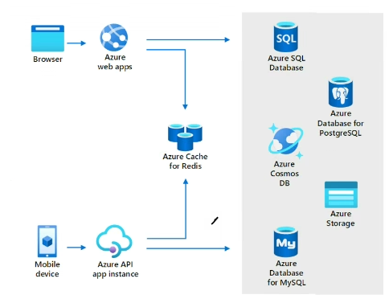
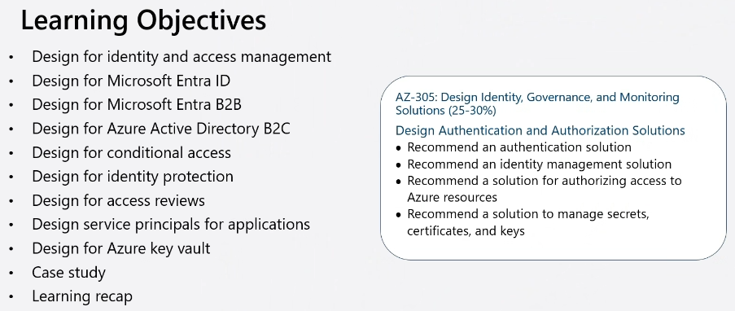
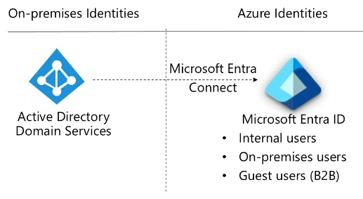
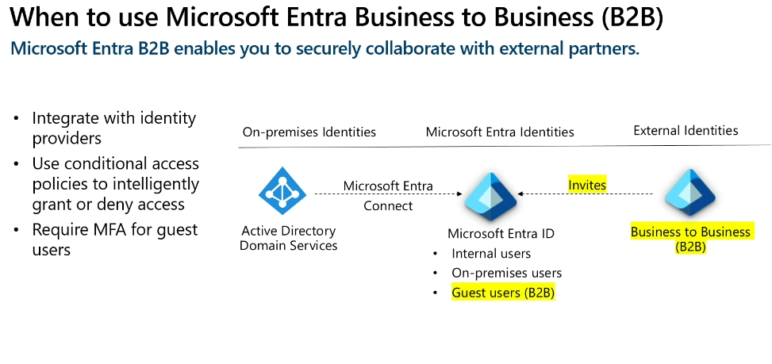

# AZ-305 - Day 2
## Table of Contents
- [AZ-305 - Day 2](#az-305---day-2)
  - [Table of Contents](#table-of-contents)
  - [Data Integration](#data-integration)
    - [Learning Objectives](#learning-objectives)
    - [Data-driven Workflows](#data-driven-workflows)
    - [Azure Data Lake](#azure-data-lake)
      - [Access Control List (ACL)](#access-control-list-acl)
        - [Example](#example)
    - [Compare Azure Blob Storage vs Azure Data Lake](#compare-azure-blob-storage-vs-azure-data-lake)
    - [Azure Databricks](#azure-databricks)
    - [Azure Synapse Analytics](#azure-synapse-analytics)
    - [Compare Data Factory to Synapse](#compare-data-factory-to-synapse)
    - [Compare Synapse to Databricks](#compare-synapse-to-databricks)
    - [Azure Stream Analytics](#azure-stream-analytics)
    - [When to use Hot/Warm/Cold data path](#when-to-use-hotwarmcold-data-path)
    - [IoT Hub vs Event Hub (not mentioned on the course but was in Questions)](#iot-hub-vs-event-hub-not-mentioned-on-the-course-but-was-in-questions)
      - [Azure Event Hub Scenario](#azure-event-hub-scenario)
        - [Scenario: Real-Time Analytics for Online Retail](#scenario-real-time-analytics-for-online-retail)
      - [Azure IoT Hub Scenario](#azure-iot-hub-scenario)
        - [Scenario: Smart Manufacturing with Predictive Maintenance](#scenario-smart-manufacturing-with-predictive-maintenance)
  - [Application Archetecture](#application-archetecture)
    - [Learning Objectives](#learning-objectives-1)
    - [Determine message event and event scenarios](#determine-message-event-and-event-scenarios)
    - [Design for Azure Queue storage](#design-for-azure-queue-storage)
    - [Designs for Service Bus queues and topics](#designs-for-service-bus-queues-and-topics)
      - [Service Bus Queues](#service-bus-queues)
      - [Service Bus Topics](#service-bus-topics)
    - [Compare messaging solutions](#compare-messaging-solutions)
    - [Design An Event Hub Messaging Solution](#design-an-event-hub-messaging-solution)
    - [Design Event-driven solution](#design-event-driven-solution)
    - [Comparison of Message and Event Solutions](#comparison-of-message-and-event-solutions)
    - [Design an IoT Hub Solution](#design-an-iot-hub-solution)
      - [When to use IoT Hub?](#when-to-use-iot-hub)
      - [Capabilities over Event Hub](#capabilities-over-event-hub)
    - [When to use Azure Cache for Redis](#when-to-use-azure-cache-for-redis)
    - [Design an Azure API Management Solution](#design-an-azure-api-management-solution)
      - [Key Features:](#key-features)
      - [Common Scenarios:](#common-scenarios)
    - [What is Infrastructure As Code (IaC)](#what-is-infrastructure-as-code-iac)
    - [Design an Azure App Configuration Solution](#design-an-azure-app-configuration-solution)
  - [Authentication \& Authorization](#authentication--authorization)
    - [Learning Objectives](#learning-objectives-2)
    - [Zero Trust Model](#zero-trust-model)
    - [How Hybrid Works](#how-hybrid-works)
      - [What is a Domain Controller (DC)?](#what-is-a-domain-controller-dc)
        - [Some Acronyms and buzz words that can come up](#some-acronyms-and-buzz-words-that-can-come-up)
    - [What is Identity and Access Management](#what-is-identity-and-access-management)
    - [When to use Microsoft Entra ID](#when-to-use-microsoft-entra-id)
      - [Connect Sync vs Cloud Sync](#connect-sync-vs-cloud-sync)
    - [When to use Microsoft Entra Business to Business (B2B)](#when-to-use-microsoft-entra-business-to-business-b2b)
    - [When to use Azure AD Business to Customer (B2C)](#when-to-use-azure-ad-business-to-customer-b2c)
    - [When to use Conditional Access](#when-to-use-conditional-access)
    - [When To Use Identity Protection](#when-to-use-identity-protection)
    - [Privileged Access Management (PAM)](#privileged-access-management-pam)
    - [Privileged Identity Management (PIM)](#privileged-identity-management-pim)
    - [PAM vs PIM](#pam-vs-pim)
      - [Key Differences:](#key-differences)
    - [When to Use Access Review](#when-to-use-access-review)
    - [Design Managed Identities](#design-managed-identities)
    - [Select Managed Identities](#select-managed-identities)
    - [Select Application Service Principal](#select-application-service-principal)
    - [Design For Key Vault](#design-for-key-vault)
    - [Key Differences:](#key-differences-1)
  - [Monitoring](#monitoring)
    - [Learning Objectives](#learning-objectives-3)
    - [Review Azure Monitor Capabilities](#review-azure-monitor-capabilities)
    - [Identify data sources and access methods](#identify-data-sources-and-access-methods)
    - [Whats is Log Analytics](#whats-is-log-analytics)
    - [Considerations for Workspaces Access Control](#considerations-for-workspaces-access-control)
    - [Design for Azure Workbooks](#design-for-azure-workbooks)
    - [Select Application Insights](#select-application-insights)
    - [Creating Alerts](#creating-alerts)
      - [Rules](#rules)
      - [Action group](#action-group)
    - [When to UseData Explorer](#when-to-usedata-explorer)
  - [Networking](#networking)
    - [Learning Objectives](#learning-objectives-4)
    - [Defense in Depth](#defense-in-depth)
    - [Design Azure Virtual Networks](#design-azure-virtual-networks)
    - [Design Network Topology](#design-network-topology)
    - [Design Outbound Connectivity](#design-outbound-connectivity)
    - [Design Routing](#design-routing)
    - [VPN Connection](#vpn-connection)
    - [Azure ExpressRoute and ExpressRoute Direct Connection](#azure-expressroute-and-expressroute-direct-connection)
    - [ExpressRoute with VPN Failover](#expressroute-with-vpn-failover)
    - [Azure Virtual WAN](#azure-virtual-wan)
    - [Choosing a Load Balancer Solution](#choosing-a-load-balancer-solution)
      - [Load Balancer (Layer 4)](#load-balancer-layer-4)
      - [Application Gateway](#application-gateway)
      - [Traffic Manager](#traffic-manager)
      - [Azure Front Door Service](#azure-front-door-service)
      - [Content Delivery Network (CDN)](#content-delivery-network-cdn)
    - [Service Endpoints](#service-endpoints)
    - [Azure Private Link](#azure-private-link)
    - [Network Security Groups (NSG)](#network-security-groups-nsg)
      - [Application Security Groups](#application-security-groups)
    - [Azure Firewall](#azure-firewall)
    - [Web Application Firewall](#web-application-firewall)
    - [DDoS Protection](#ddos-protection)
    - [Azure Bastion](#azure-bastion)
    - [Just in Time (JIT) Network Access](#just-in-time-jit-network-access)

## Data Integration
### Learning Objectives

### Data-driven Workflows
Azure Data Factory is a cloud-based ETL (Extract Transform Load) and data ingestion service that can help you create and schedule data-driven workflows (called pipelines) that can ingest data from disparate data stores

You can use Azure Data Factory to:
1. Orchestrate data movement
2. Transform data at scale

### Azure Data Lake
Azure Data Lake Storage is a comprehensive, scalable and cost-effective data lake solution for big data analytics built into Azure

Use Azure Data Lake when you need:
- A data repository on the cloud for managing large volumes of data
- To manage a diverse collection of data types such as JSON files, CSV, Log files, or other diverse formats
- Real-time data ingestion and storage
- Unlike storage account containers, data lake container support Access Control Lists (ACL)

#### Access Control List (ACL)

An **Access Control List (ACL)** is a list of rules that specify which users or system processes are granted access to objects, and what operations are allowed on those objects. An ACL typically includes a set of permissions attached to an object like a file, directory, or network resource, defining who can read, write, or execute that object.

##### Example

Consider a file named `document.txt`. The ACL for this file might look like this:

| User/Process | Permission |
|--------------|------------|
| Alice        | Read, Write|
| Bob          | Read       |
| System       | Execute    |

In this example:
- **Alice** has read and write permissions for `document.txt`.
- **Bob** has read permission for `document.txt`.
- **System** has execute permission for `document.txt`.

These permissions ensure that only authorized users and processes can perform specific actions on the file.

### Compare Azure Blob Storage vs Azure Data Lake

| **Feature**             | **Azure Storage**                                                               | **Azure Data Lake Storage (Gen2)**                                                              |
|-------------------------|---------------------------------------------------------------------------------|------------------------------------------------------------------------------------------------|
| **Purpose**             | General-purpose storage for a wide range of data types and use cases.           | Optimized for big data analytics and large-scale data processing.                               |
| **Data Types**          | Supports blobs, files, queues, and tables.                                       | Supports structured, semi-structured, and unstructured data.                                    |
| **Storage Model**       | Object storage model.                                                           | File system storage model with hierarchical namespace.                                          |
| **Scalability**         | Highly scalable with different storage tiers (Hot, Cool, Archive).               | Massively scalable, designed for storing petabytes to exabytes of data.                         |
| **Performance**         | Good performance for general storage needs.                                      | High performance for big data analytics workloads.                                              |
| **Security**            | Provides encryption at rest, access control, and network security features.     | Provides encryption at rest, access control, and advanced security features for data lakes.     |
| **Use Cases**           | Storing images, documents, backups, and other general-purpose data.              | Storing large-scale data for analytics, machine learning, and big data processing.              |

[Blob Storage feature support in Azure Storage accounts 📎](https://learn.microsoft.com/en-us/azure/storage/blobs/storage-feature-support-in-storage-accounts#standard-general-purpose-v2-accounts)

### Azure Databricks
Azure Databricks is a fully managed, cloud-based Big Data and

### Azure Synapse Analytics

### Compare Data Factory to Synapse

| **Feature**              | **Azure Data Factory (ADF)**                                             | **Azure Synapse Analytics**                                                          |
|--------------------------|---------------------------------------------------------------------------|--------------------------------------------------------------------------------------|
| **Primary Focus**        | Data integration and orchestration.                                       | Unified analytics service for data integration, warehousing, and analytics.          |
| **Data Integration**     | Supports ETL (Extract, Transform, Load) processes.                        | Supports ETL, ELT (Extract, Load, Transform), and data warehousing.                  |
| **Data Processing**      | Limited to data movement and transformation.                              | Supports big data processing, machine learning, and real-time analytics.             |
| **Data Sources**         | Connects to various data sources like databases, cloud services, and files.| Connects to a wide range of data sources, including on-premises and cloud.           |
| **Workload Management**  | Focuses on orchestrating data workflows.                                  | Manages data workloads with integrated Spark pools and SQL pools.                    |
| **User Interface**       | Graphical interface for building data pipelines.                          | Integrated environment for building and managing data pipelines, notebooks, and more.|
| **Templates**            | Provides templates for common ETL scenarios.                              | Does not provide templates for pipeline creation.                                    |
| **CI/CD Integration**    | Supports CI/CD with GitHub integration.                                   | Limited CI/CD capabilities compared to ADF.                                           |
| **Data Exploration**     | Limited to data movement and transformation.                              | Supports ad-hoc data exploration with integrated notebooks and SQL pools.            |
| **Supported Activities** | Includes activities like copy, data flow, and custom activities.          | Includes activities like data flows, Spark jobs, and SQL pool stored procedures.      |

[Data integration in Azure Synapse Analytics versus Azure Data Factory 📎](https://learn.microsoft.com/en-us/azure/synapse-analytics/data-integration/concepts-data-factory-differences#available-features-in-adf--azure-synapse-ana)

***From a practice exam:** Data factory is the recommend method when migrating data from Data Lake Gen1 to Gen2*

### Compare Synapse to Databricks

| **Feature**                | **Azure Synapse Analytics**                                                | **Azure Databricks**                                                        |
|----------------------------|----------------------------------------------------------------------------|----------------------------------------------------------------------------|
| **Primary Focus**          | Unified analytics service for data integration, warehousing, and analytics.| Big data processing, machine learning, and real-time analytics.            |
| **Data Integration**       | Supports ETL (Extract, Transform, Load) and ELT (Extract, Load, Transform).| Focuses on ETL and data processing with Apache Spark.                      |
| **Data Processing**        | Supports SQL queries, Apache Spark, and serverless SQL pools.              | Built on Apache Spark, optimized for large-scale data processing.          |
| **Data Sources**           | Connects to various data sources, including on-premises and cloud.         | Connects to a wide range of data sources, including on-premises and cloud. |
| **Workload Management**    | Manages data workloads with integrated SQL and Spark pools.                | Manages data workloads with collaborative notebooks and Spark clusters.    |
| **User Interface**         | Integrated environment for building and managing data pipelines.           | Integrated environment for building and managing data pipelines, notebooks.|
| **Templates**             | Provides templates for common ETL scenarios.                               | Does not provide templates for pipeline creation.                          |
| **CI/CD Integration**      | Supports CI/CD with GitHub integration.                                    | Limited CI/CD capabilities compared to Synapse.                           |
| **Data Exploration**       | Supports ad-hoc data exploration with integrated notebooks and SQL pools.  | Supports ad-hoc data exploration with integrated notebooks and Spark.      |
| **Supported Activities**   | Includes activities like data flows, Spark jobs, and SQL pool stored procedures.| Includes activities like data flows, Spark jobs, and machine learning models.|

[Comparing Azure Databricks and Azure Synapse Analytics 📎](https://learn.microsoft.com/en-us/data-engineering/playbook/articles/databricks-vs-synapse)

### Azure Stream Analytics
Azure Stream Analytics is a real-time analytics and complex event-processing engine that is designed to analyze and process high volumes of fast streaming data from multiple sources simultaneously.

### When to use Hot/Warm/Cold data path

### IoT Hub vs Event Hub (not mentioned on the course but was in Questions)

| **Feature**             | **Azure Event Hub**                                                     | **Azure IoT Hub**                                                         |
|-------------------------|-------------------------------------------------------------------------|---------------------------------------------------------------------------|
| **Primary Focus**       | Big data streaming and event ingestion.                                 | Connecting IoT devices to the cloud.                                      |
| **Communication**       | One-way communication from devices or sources.                          | Bi-directional communication between devices and the cloud.               |
| **Protocol Support**    | Supports HTTPS, AMQP, and AMQP over WebSockets.                         | Supports HTTPS, AMQP, MQTT, and AMQP over WebSockets.                     |
| **Connections**         | Supports up to 5000 simultaneous connections.                           | Supports more than 5000 simultaneous connections, up to millions.         |
| **Security**            | Uses shared access tokens for authentication.                           | Each device has its own unique security credentials.                      |
| **Device Management**   | Limited device management capabilities.                                 | Provides device management features like device twins and cloud-to-device messaging. |
| **Data Processing**     | Focuses on high-throughput data streaming.                              | Focuses on ingesting data from IoT devices and integrating it into business applications. |
| **Integration**         | Integrated with big data and analytics services like Databricks, Stream Analytics, ADLS, and HDInsight. | Integrated with Azure IoT Edge for edge computing and device management.  |
| **Use Cases**           | Ideal for scenarios requiring high-throughput data ingestion and processing. | Ideal for IoT scenarios requiring device connectivity, data ingestion, and device management. |

#### Azure Event Hub Scenario
##### Scenario: Real-Time Analytics for Online Retail
A major online retail company wants to analyze real-time clickstream data from its website to understand user behavior and improve the customer experience. The company needs to handle millions of events per second and perform real-time analytics to identify popular products, abandoned carts, and browsing patterns.

- **Solution**: Use Azure Event Hub to ingest and process the high volume of clickstream data.
- **Implementation**:
  - **Data Ingestion**: Event Hub collects clickstream data from the website.
  - **Real-Time Processing**: Azure Stream Analytics or Apache Spark processes the incoming data in real time.
  - **Storage and Analytics**: Processed data is stored in Azure Data Lake or Azure SQL Database for further analysis and reporting.
  - **Outcome**: The company gains valuable insights into customer behavior, allowing them to optimize the website, improve marketing strategies, and enhance the overall customer experience.

#### Azure IoT Hub Scenario
##### Scenario: Smart Manufacturing with Predictive Maintenance
A manufacturing company wants to implement a smart factory solution to monitor its equipment in real time and predict maintenance needs to avoid unplanned downtime. The company uses various IoT sensors and devices to collect data on equipment performance, temperature, vibration, and other parameters.

- **Solution**: Use Azure IoT Hub to connect and manage the IoT devices, and Azure Stream Analytics for real-time data processing.
- **Implementation**:
  - **Device Connectivity**: IoT Hub connects and manages the IoT devices, ensuring secure and reliable data transmission.
  - **Real-Time Processing**: Azure Stream Analytics processes the data in real time to identify patterns and anomalies indicating potential equipment failures.
  - **Actions and Alerts**: Based on the analysis, alerts are triggered for maintenance teams, and automated actions are taken to prevent equipment failure.
  - **Outcome**: The company reduces downtime, optimizes maintenance schedules, and improves overall operational efficiency by predicting and preventing equipment failures.

## Application Archetecture
### Learning Objectives

### Determine message event and event scenarios
Does the sending component expect the communication to be processed in a specific way?

### Design for Azure Queue storage
Azure Storage Queue is a service for storing large number of messages

- Accessed with authenticated calls using HTTP/S.
- Messages can be up to 64KB in size.
- May contain millions of messages, up to the total capacity limit of a storage account.

### Designs for Service Bus queues and topics
Service Bus decouples applications and services from each other.

#### Service Bus Queues
- Built on top of a dedicated messaging infrastructure

#### Service Bus Topics

### Compare messaging solutions

[SLA for Storage 📎](https://www.azure.cn/en-us/support/sla/storage/)

[Storage queues and Service Bus queues - compared and contrasted 📎](https://learn.microsoft.com/en-us/azure/service-bus-messaging/service-bus-azure-and-service-bus-queues-compared-contrasted)

| **Comparison Criteria**     | **Storage Queues**                                                                 | **Service Bus Queues**                                                   |
|-----------------------------|------------------------------------------------------------------------------------|--------------------------------------------------------------------------|
| **Ordering Guarantee**      | No                                                                                 | Yes - First-In-First-Out (FIFO) (by using message sessions)              |
| **Delivery Guarantee**      | At-Least-Once                                                                      | At-Least-Once (using PeekLock receive mode. It's the default)            |
|                             |                                                                                    | At-Most-Once (using ReceiveAndDelete receive mode)                       |
| **Atomic Operation Support**| No                                                                                 | Yes                                                                      |
| **Receive Behavior**        | Non-blocking (completes immediately if no new message is found)                    | Blocking with or without a timeout (offers long polling, or the "Comet technique")  |
|                             |                                                                                    | Non-blocking (using .NET managed API only)                               |
| **Push-Style API**          | No                                                                                 | Yes (Our .NET, Java, JavaScript, and Go SDKs provide push-style API)     |
| **Receive Mode**            | Peek & Lease                                                                       | Peek & Lock, Receive & Delete                                            |
| **Exclusive Access Mode**   | Lease-based                                                                        | Lock-based                                                               |
| **Lease/Lock Duration**     | 30 seconds (default) 7 days (maximum) (You can renew or release a message lease using the UpdateMessage API.) | 30 seconds (default) You can renew the message lock for the same lock duration each time manually or use the automatic lock renewal feature where the client manages lock renewal for you. |
| **Lease/Lock Precision**    | Message level Each message can have a different timeout value, which you can then update as needed while processing the message, by using the UpdateMessage API. | Queue level (each queue has a lock precision applied to all of its messages, but the lock can be renewed as described in the previous row) |
| **Batched Receive**         | Yes (explicitly specifying message count when retrieving messages, up to a maximum of 32 messages) | Yes (implicitly enabling a pre-fetch property or explicitly by using transactions)  |
| **Batched Send**            | No                                                                                 | Yes (by using transactions or client-side batching)                      |

### Design An Event Hub Messaging Solution
Azure Event Hub is a fully managed. real time data ingestion service.
- Order events by when they are received - by time offsets.
- Uses a pull model allowing multiple reads from consumers.
- Scaling is controlled by how many throughput units or processing units you purchase.
- Receiving real-time streaming data.

### Design Event-driven solution
Azure Event Grid is a routing service connecting data sources with event handlers.
- Event sources include Azure resources or custom topics (you create)
- Event handlers react to an event
- Useful for serverless application and operations automation
- Uses Pay-per-operation or pay-per-use pricing models

### Comparison of Message and Event Solutions
| Services | Purpose | Type | What to use |
| -------- | ------- | ---- | ----------- |
| Event Grid | Reactive programming | Event distribution (discrete) | React to status changes |
| Event Hubs | Big data pipeline | Event streaming (series) | Telemetry and distributed data streaming |
| Service Bus | High-value eneterprise messaging | Message | Order processing and financial transactions |
| Storage queues | Large-volume messaging queues | Message | thing |

[Choose between Azure messaging services - Event Grid, Event Hubs, and Service Bus 📎](https://learn.microsoft.com/en-us/azure/service-bus-messaging/compare-messaging-services)

### Design an IoT Hub Solution
Central message hub for IoT applications and its attached devices.
#### When to use IoT Hub?
- Application complexity
- Data throughput
- Securing solution end to end allowing for per-device authentication
- Bi-directional communication

#### Capabilities over Event Hub
- Per-device identity
- File upload from devices
- Device provisioning service

### When to use Azure Cache for Redis
Store frequently accessed data so that applications can be responsive to users.
- Key scenarios - data cache, content cache, session store, job & message queuing and distributed transactions
- Fully managed solution
- High availability - responds automatically to both anticipated and unanticipated changes in demand
- Same performance and scaling benefits throughout the world -network isolation, data encryption in transit.

[What is Azure Cache for Redis? 📎](https://learn.microsoft.com/en-us/azure/azure-cache-for-redis/cache-overview)

### Design an Azure API Management Solution
Publish, secure, maintain and analyse all your company's APIs
- Brings multiple APIs under a single administrative umbrella - centralised management
- Manage permissions and access
- Ensure compliance across API
- Standardize API specs
- Protect the APIs from malicious usage

**Azure API Management** is a fully managed service that helps developers securely expose their APIs to external and internal customers. It provides a set of tools and services for creating, publishing, and managing APIs, as well as for enforcing security, scaling, and monitoring API usage.

#### Key Features:
- **API Gateway**: Acts as a facade for your backend services, providing consistent configuration of routing, security, throttling, caching, and observability.
- **Management Plane**: Offers a unified interface for managing APIs, including creating and publishing APIs, setting policies, and monitoring usage.
- **Developer Portal**: Provides a customizable portal for developers to discover, try out, and learn about APIs.
- **Security**: Enforces authentication, authorization, and usage limits to protect your APIs.
- **Scalability**: Supports high-throughput and scalable applications, ensuring your APIs can handle varying loads.
- **Hybrid and Multicloud Management**: Manages APIs across different environments, including on-premises, Azure, and other clouds.

#### Common Scenarios:
- **Legacy Modernization**: Abstract and modernize legacy backends, making them accessible from new cloud services and modern applications.
- **API-Centric Integration**: Simplify and reduce the cost of application integration by using APIs as the primary mechanism for accessing data and services.
- **Multi-Channel User Experiences**: Enable user experiences across web, mobile, wearable, and IoT applications.
- **B2B Integration**: Facilitate business-to-business integration by exposing APIs to partners and customers.

### What is Infrastructure As Code (IaC)
Infrastructure as code (IaC) is the process of automating your infrastructure provisioning.
- The IaC model generates the same environment every time it is applied
- Solves the problem of environmental drift
- Enables teams to test applications i production-like environments early
- Where possible, use declarative definition files

ARM Deployment Modes
- **Complete:** In complete mode, Resource Manager **deletes** resources that exist in the resource group but aren't specified in the template.
- **Incremental:** In incremental mode, Resource Manager **leaves unchanged** resources that exist in the resource group but aren't specified in the template. Resources in the template are added to the resource group.

**You can view your resources in a tree like structure and get their ARM templates using Resource Explorer**

### Design an Azure App Configuration Solution
Azure App Configuration centrally manages application settings and feature flags.
- Flexible key representation and mappings
- Point-in-time replay settings
- Dedicated UI for feature flag management
- Comparison of two sets of configurations on custom-defined dimensions
- Enhanced security through Azure-managed identities and encryption

## Authentication & Authorization
The 5 A's

- Authentication
- Authorization
- Accounting
- Auditing
- Administration

### Learning Objectives

### Zero Trust Model
Never trust, always verify.
- Employee and partner user roles
- Trusted and compliant devices
- Physical and virtual locations
- Client apps and authentication method

[Embrace proactive security with Zero Trust 📎](https://www.microsoft.com/en-us/security/business/zero-trust)

### How Hybrid Works

#### What is a Domain Controller (DC)?

In it's rawest form it is:
- A Database
- A important folder called (SYSVOL)

It is responsible for the 5 A's:
- Authentication
- Authorization
- Accounting
- Auditing
- Administration

Strictly speaking user@domain.com is a UPN (User Principal Name) Although they look like email addresses they can only be considered as one if if linked to exchange (or another mail service provider)

##### Some Acronyms and buzz words that can come up
- **UPN:** User Principal Name - e.g. user@domain.com - *Note this looks like an email address but can only truly can be considered so if it is linked to exchange or another mail service provider*
- **SIP:** Session initiation protocol - A signaling protocol used for initiating, maintaining, and terminating communication sessions
- **DNS** Domain Name System - A server that translates domain names (like example.com) into IP addresses (like 192.0.2.1), making it possible for devices to find and communicate with each other, both on the internet and within private networks.
- **DMZ** Demilitarized Zone: a secure network segment that acts as a buffer between a private internal network and the untrusted external network (like the internet). It hosts public-facing services while keeping the internal network protected.
- **Win32 apps:** An application that is designed to run on the Windows operating system using the Win32 API.

In a on-prem only domain you can have internal top level domains (TLD) *.local, .intranet etc...* These domains are not globally routable (if you were yo use a .local name outside of the on-premise ecosystem it would not resolve back to your intend address). In Entra we must use globally routable domains (.com, .edu, .co.uk, .org etc...)

In traditional on-prem only setups we would have a DNS server on the DC which would be used to resolve internal domain addresses internal and then another DNS server in the DMZ to resolve external names.

When shifting to a hybrid cloud model every effort to eliminate local domains should be made. We then end up in a state where the Internal DNS can route private traffic and the DMS DNS server Routing public traffic using the same routable names. This is known as Split Brain/Horizon DNS.

In Active Directory (AD) the authentication services are:
- Kerberos
- NTLM (NT LAN Manager)

In Entra we have different protocols for authentication:
- SAML (Security Assertion Markup Language)
- OAuth
- OIDC (OpenID Connect)
- WS-Fed (Web Services Federation)

The reason we have so many different protocols in Entra is because of the way cloud distributes the data and services.

[Entra ID Pricing 📎](https://www.apps4rent.com/azure-active-directory-pricing.html)

### What is Identity and Access Management

### When to use Microsoft Entra ID
Microsoft Entra ID is a cloud-based solution for identity and access management. Microsoft Entra DI is a multitenant, cloud-based directory, and identity management service.
- Centralised identity management
- Establish a single Microsoft Entra tenant
- Use Microsoft Entra Connect, or Microsoft Entra Connect Sync for hybrid identity sync

#### Connect Sync vs Cloud Sync

| **Feature**                                             | **Connect Sync** | **Cloud Sync** |
|---------------------------------------------------------|------------------|----------------|
| Connect to single on-premises AD forest                 | ●                | ●              |
| Connect to multiple on-premises AD forests              | ●                | ●              |
| Connect to multiple disconnected on-premises AD forests |                  | ●              |
| Lightweight agent installation model                    |                  | ●              |
| Multiple active agents for high availability            |                  | ●              |
| Support for user objects                                | ●                | ●              |
| Support for group objects                               | ●                | ●              |
| Support for contact objects                             | ●                | ●              |
| Support for device objects                              | ●                |                |
| Allow basic customization for attribute flows           | ●                | ●              |
| Synchronize Exchange online attributes                  | ●                | ●              |
| Synchronize extension attributes 1-15                   | ●                | ●              |
| Synchronize customer defined AD attributes              | ●                | ●              |
| Support for Password Hash Sync                          | ●                | ●              |
| Support for Pass-Through Authentication                 | ●                |                |
| Support for federation                                  | ●                | ●              |
| Seamless Single Sign-on                                 | ●                | ●              |
| Supports installation on a Domain Controller            | ●                | ●              |
| Support for Windows Server 2016                         | ●                | ●              |
| Filter on Domains/OUs/groups                            | ●                | ●              |
| Filter on objects' attribute values                     | ●                |                |
| Allow minimal set of attributes to be synchronized      | ●                | ●              |
| Allow removing attributes from flowing from AD to Entra ID | ●             | ●              |
| Allow advanced customization for attribute flows        | ●                |                |
| Support for password writeback                          | ●                | ●              |
| Support for device writeback                            | ●                | Customers should use Cloud Kerberos trust for this moving forward |
| Support for group writeback                             |                  | ●              |
| Support for merging user attributes from multiple domains | ●              |                |
| Microsoft Entra Domain Services support                 | ●                |                |
| Exchange hybrid writeback                               | ●                | ●              |
| Unlimited number of objects per AD domain               | ●                |                |
| Support for up to 150,000 objects per AD domain         | ●                | ●              |
| Groups with up to 50,000 members                        | ●                | ●              |
| Large groups with up to 250,000 members                 | ●                |                |
| Cross domain references                                 | ●                | ●              |
| Cross forest references                                 | ●                |                |
| On-demand provisioning                                  |                  | ●              |
| Support for US Government                               | ●                | ●              |

### When to use Microsoft Entra Business to Business (B2B)
Microsoft Entra B2B enables you to securely collaborate with external parties

- Integrate with identity providers
- Use conditiona access polocies to intel...

### When to use Azure AD Business to Customer (B2C)
Azure AD B2C is a tenant to manage customer identities and their application access.

### When to use Conditional Access
Conditional Access is a Microsoft Entra tool that allows (or denies) access to resources
- Use to enable MFA
- Require managed devices
- Access only approved client applications
- Exclude countries from which you never expect a sign in
- Respond to potentially compromised accounts
- Completely block access
- Block legacy authentication protocols
- Test using the report-only mode

### When To Use Identity Protection
Identity protection is a Microsoft Entra tool that automates the detection and remediation of identity-based risks.
- Configure the policies and actively review the results
- Set the sing-in risk policy to medium and above and allow self-remediation options
- Set the user risk policy threshold to High
- Allow for excluding users - emergency access or break-glass administrator accounts
- Send data to Conditional Access or other security information (SIEM) tool

There are 3 levels of User Risks (think of it like a pain threshold, what can be tolerated)
- High
- Medium
- Low

| **Risk Detection**                            | **Detection Type**         | **Type**        | **riskEventType**                                                                        |
|-----------------------------------------------|----------------------------|-----------------|------------------------------------------------------------------------------------------|
| **Sign-in risk detections**                   |                            |                 |                                                                                          |
| Activity from anonymous IP address            | Offline                    | Premium         | riskyIPAddress                                                                           |
| Additional risk detected (sign-in)            | Real-time or Offline       | Nonpremium      | generic = Premium detection classification for non-P2 tenants                            |
| Admin confirmed user compromised              | Offline                    | Nonpremium      | adminConfirmedUserCompromised                                                            |
| Anomalous Token                               | Real-time or Offline       | Premium         | anomalousToken                                                                           |
| Anonymous IP address                          | Real-time                  | Nonpremium      | anonymizedIPAddress                                                                      |
| Atypical travel                               | Offline                    | Premium         | unlikelyTravel                                                                           |
| Impossible travel                             | Offline                    | Premium         | mcasImpossibleTravel                                                                     |
| Malicious IP address                          | Offline                    | Premium         | maliciousIPAddress                                                                       |
| Mass Access to Sensitive Files                | Offline                    | Premium         | mcasFinSuspiciousFileAccess                                                              |
| Microsoft Entra threat intelligence (sign-in) | Real-time or Offline       | Nonpremium      | investigationsThreatIntelligence                                                         |
| New country                                   | Offline                    | Premium         | newCountry                                                                               |
| Password spray                                | Offline                    | Premium         | passwordSpray                                                                            |
| Suspicious browser                            | Offline                    | Premium         | suspiciousBrowser                                                                        |
| Suspicious inbox forwarding                   | Offline                    | Premium         | suspiciousInboxForwarding                                                                |
| Suspicious inbox manipulation rules           | Offline                    | Premium         | mcasSuspiciousInboxManipulationRules                                                     |
| Token issuer anomaly                          | Offline                    | Premium         | tokenIssuerAnomaly                                                                       |
| Unfamiliar sign-in properties                 | Real-time                  | Premium         | unfamiliarFeatures                                                                       |
| Verified threat actor IP                      | Real-time                  | Premium         | nationStateIP                                                                            |
| **User risk detections**                      |                            |                 |                                                                                          |
| Additional risk detected (user)               | Real-time or Offline       | Nonpremium      | generic = Premium detection classification for non-P2 tenants                            |
| Anomalous user activity                       | Offline                    | Premium         | anomalousUserActivity                                                                    |
| Attacker in the Middle                        | Offline                    | Premium         | attackerinTheMiddle                                                                      |
| Leaked credentials                            | Offline                    | Nonpremium      | leakedCredentials                                                                        |
| Microsoft Entra threat intelligence (user)    | Real-time or Offline       | Nonpremium      | investigationsThreatIntelligence                                                         |
| Possible attempt to access Primary Refresh Token (PRT) | Offline            | Premium         | attemptedPrtAccess                                                                       |
| Suspicious API Traffic                        | Offline                    | Premium         | suspiciousAPITraffic                                                                     |
| Suspicious sending patterns                   | Offline                    | Premium         | suspiciousSendingPatterns                                                                |
| User reported suspicious activity             | Offline                    | Premium         | userReportedSuspiciousActivity                                                           |

### Privileged Access Management (PAM)

- JIT - Just In Tim
- JEA - Just Enough Access
- JLE - Jut Long Enough

### Privileged Identity Management (PIM)
Same as PAM but considers The task being carried out instead of what Action is needed

### PAM vs PIM
**Privileged Identity Management (PIM)** and **Privileged Access Management (PAM)** are both crucial for managing and securing access, but they serve different purposes. 

| **Feature**                | **PIM (Privileged Identity Management)** | **PAM (Privileged Access Management)** |
|----------------------------|-----------------------------------------|----------------------------------------|
| **Focus**                  | Managing user privileges                | Monitoring and controlling access      |
| **Primary Goal**           | Control who has access to resources     | How access is granted and used         |
| **Authentication**         | Ensures users have the right privileges | Monitors and audits access usage       |
| **Authorization**          | Determines access based on roles/attributes | Controls and logs access events         |
| **Use Case**               | Prevent unauthorized access             | Prevent misuse of access               |
| **Example**                | Granting admin rights to specific users | Tracking admin activities              |

#### Key Differences:
- **PIM** focuses on **what access a user is granted** and **manages user identities** with elevated privileges.
- **PAM** focuses on **how access is controlled and monitored** whenever a user requests access to a resource.

### When to Use Access Review
Access reviews is a Entra tool to review user access and ensure they should have continued access to resources.

- Determine the purpose of the access review
- Engage the right stakeholders
- Create an access review plan
- Determine who will conduct the reviews
- Decide who can sel-asses access
- Determine what resource types will be reviewed
- Start small - pilot your plan - keep people informed

### Design Managed Identities
Managed identities provide an identity for application authentication.

- The source is an Azure resource
- The target supports Microsoft Entra ID authentication and Azure RBAC
- No credential rotation or certificate management

### Select Managed Identities

### Select Application Service Principal
The local representation, or application instance, of an object in a single tenant or directory

### Design For Key Vault

**Azure Key vault is region specific**

Tiers:
- Standard
- Premium

The main difference between **Azure Key Vault Standard** and **Azure Key Vault Premium** lies in the level of security and the type of key protection they offer:

| **Feature**                | **Standard**                          | **Premium**                          |
|----------------------------|---------------------------------------|--------------------------------------|
| **Key Protection**         | Software-protected keys               | Hardware Security Module (HSM)-protected keys |
| **Security Level**         | Software security                     | HSM security + Software security     |
| **FIPS 140-2 Validation**  | Not applicable                        | Level 3 validated                    |
| **Use Case**               | General key management                | High-security key management         |

### Key Differences:
- **Key Protection**: Standard tier uses software-protected keys, while Premium tier includes HSM-protected keys for enhanced security.
- **Security Level**: Premium tier offers an additional layer of security with HSM protection on top of the software security provided by Azure.
- **FIPS 140-2 Validation**: Premium tier keys are FIPS 140-2 Level 3 validated, ensuring compliance with stringent security standards.

Would you like more details on how to choose the right tier for your needs?

## Monitoring

### Learning Objectives

### Review Azure Monitor Capabilities

### Identify data sources and access methods

**You can enable the sending of additional logs etc via the Diagnostic settings of a resource.**

### Whats is Log Analytics

*Log analytic workspaces are per application.*

### Considerations for Workspaces Access Control
Workspace deployment models include centralised, decentralised, and hybrid

### Design for Azure Workbooks

### Select Application Insights

### Creating Alerts

#### Rules
What am I watching out for

#### Action group
Something that happens when something has been detected.

- **Notifications:** Email/SMS
- **Actions:** Automation Runbooks, Webhooks, Secure Webhooks, Azure functions, Azure Logic Apps, etc...

### When to UseData Explorer

[Azure Data Explorer 📎](https://dataexplorer.azure.com/)

*The Azure Data Explorer includes a sample database for practising writing KQL*

 > For KQL Practice: [Kusto Detective Agency 📎](https://detective.kusto.io/)

 ## Networking
 ### Learning Objectives
 

### Defense in Depth
Provide a layered approach and multiple levels of protection.

Azure Information Protection is how we classify our information, the use of labels, headers footers watermarks encryptions etc.

### Design Azure Virtual Networks
Azure Virtual Network is the fundamental building block for your private network in Azure. A virtual network is a virtual, isolated portion of the Azure public network. Use VNets to communicate between Azure resources, the Internet and op-premises networks.

> The first 4 addresses of a subnet are always reserved:
> - xxx.xxx.xxx.0 - Network address
> - xxx.xxx.xxx.1 - Gateway
> - xxx.xxx.xxx.2 - DNS
> - xxx.xxx.xxx.3 - DNS

### Design Network Topology

### Design Outbound Connectivity

[Microsoft 365 URLs and IP address ranges 📎](https://learn.microsoft.com/en-us/microsoft-365/enterprise/urls-and-ip-address-ranges?view=o365-worldwide)

[NAT support with Office 365 📎](https://learn.microsoft.com/en-us/microsoft-365/enterprise/nat-support-with-microsoft-365?view=o365-worldwide)

### Design Routing

### VPN Connection
A VPN gateway is a type of virtual network gateway that sends encrypted traffic between an Azure virtual network and an on-premises location.

**The Only Way To Connect a VNet to an On-Premises network**

### Azure ExpressRoute and ExpressRoute Direct Connection

### ExpressRoute with VPN Failover

### Azure Virtual WAN
Azure Virtual WAN is a networking service that brings many networking,security, and routing functionalities together to provide a single operational interface.

### Choosing a Load Balancer Solution

#### Load Balancer (Layer 4)
High-performance, low-latency load-balancing for all UDP and TCP protocols
- Layer 4 Load balancing for all UDP and TCP protocols
- Manages inbound and outbound connections
- Provides public and internal load-balance endpoints
- Uses rules to map inbound connections to backend destinations
- Health probes manage service availability
- **Regional**

#### Application Gateway
- **Regional**

#### Traffic Manager
- DNS-based traffic load balancer
- **Global**

#### Azure Front Door Service
- Layer 7
- **Global**

#### Content Delivery Network (CDN)
- Uses Point of Presence (POP) locations to distribute content.
- Not *really* a Load Balancer
- **Global**

### Service Endpoints

### Azure Private Link

### Network Security Groups (NSG)

#### Application Security Groups
Can be used to create group machines and apply NSG rules to these groups.

### Azure Firewall

**If you require many firewalls there is a firewall manager resource that can help with managing them and their rules.**

### Web Application Firewall

### DDoS Protection

**NOT INCLUDED AS PART OF AZURE FIREWALL**

### Azure Bastion
The Azure Bastion service is a fully platform-managed PaaS service which provides secure and seamless RDP/SSH connectivity to your virtual machines directly in the Azure portal over TLS

**Can be costly, always on**

### Just in Time (JIT) Network Access
With JIT, you can lock down the inbound traffic to your VMs, reducing exposure to attacks while providing easy access to connect to VMs when needed.

**Part of the Defender for Cloud suite of features**

