# AZ-305 - Day 3
## Business Continuity
### Learning Objectives
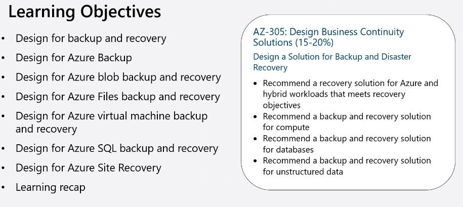

### Plan for backup and recovery
Identify your business needs and create a plan to address those needs
- What are your workloads and their usage?
- What are the usage patterns for your workload?
- What are the availability metrics
  - MTTR - Mean Time To Repair.
  - MTBF - Mean Time Between Failure
- What are the recovery metrics
  - RTO - Recovery Time Objective - Time taken to get back up
  - RPO - Recovery Point Objective - How much data can we afford to lose
  - RLO - Recovery Level Objective - What do we need to do to recover, for example if email is deleted (can we restore one file, 1 mailbox, the whole server etc.)
- What are the workload availability targets?
- What are your SLAs?

*RTO Metrics are important, we need to think about should time taken to re-key data, and should other operations that need to take place to get back to a workable state be considered.*

### When To Use Azure Backup
Azure Backup is a full-service backup and recovery solutions
- Unlimited scaling with high availability and unlimited data transfer
- Automatic replication of locally redundant storage and geo-redundant storage using a pay-as-you-use model
- Application-consistent backups with secure transmission and storage of your data in Azure
- No limits on the length of time you can keep the backup data

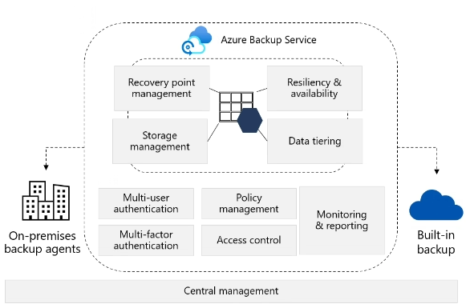

#### Azure Recovery Services Vault vs Backup Vaults

| **Feature**                | **Azure Recovery Services Vault (IaaS like)** | **Azure Backup Vault (PaaS like)** |
|----------------------------|-----------------------------------|------------------------|
| **Purpose**                | Provides backup and recovery solutions for Azure VMs, Azure Files, SQL databases, and more. | Stores backups for specific Azure resources like VM disks, Azure Blobs, and Azure Database for PostgreSQL. |
| **Model**                  | Based on the Azure Resource Manager model. | Based on the older Azure Service Manager model. |
| **Capabilities**           | Enhanced security features, central monitoring, instant restore for IaaS VMs. | Limited to snapshot-level backups, supports fewer datasources. |
| **Supported Workloads**    | Supports a wide range of workloads including IaaS VMs, SQL databases, and Azure Files. | Supports specific Azure resources like Azure VM disks, Azure Blobs, and Azure Database for PostgreSQL. |
| **Storage Redundancy**     | Offers geo-redundant storage (GRS) by default. | Typically less expensive and easier to use, but less secure. |
| **Use Case**               | Ideal for comprehensive backup and disaster recovery solutions. | Suitable for simpler backup needs with fewer security requirements. |

##### Key Differences:
- **Azure Recovery Services Vault** is the modern solution with more features and capabilities, supporting a wide range of workloads.
- **Azure Backup Vault** is an older, simpler solution focused on specific Azure resources and snapshot-level backups.

### Considerations For Soft Deletes
Consider soft deletes with recovery times from 1 to 365
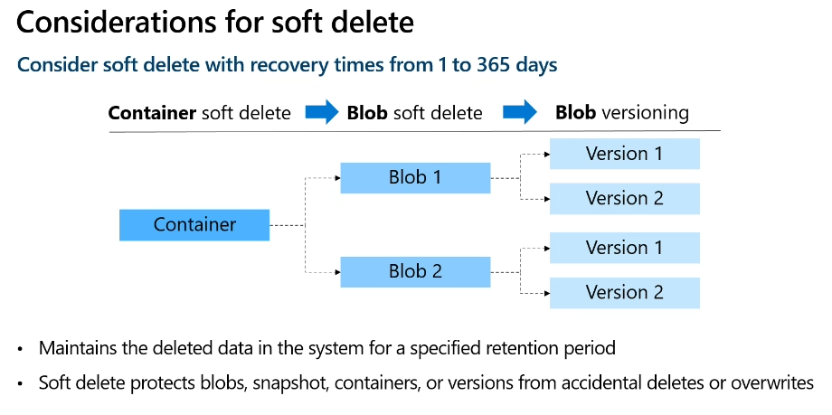

### Considerations for Point-in-Time Restore
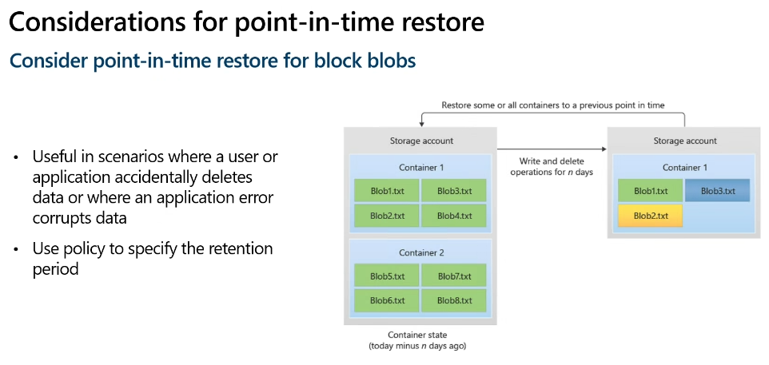

### Considerations fro Azure Files Backup and Recovery
Consider snapshots for both blobs and Azure Files
- Organise file shares with backup in mind
- Snapshots can be on-demand or scheduled using Azure Backup and backup policies
- Snapshots are at the file share root - retrieval is at file
- Use snapshots to cover the time between daily backups
- ...

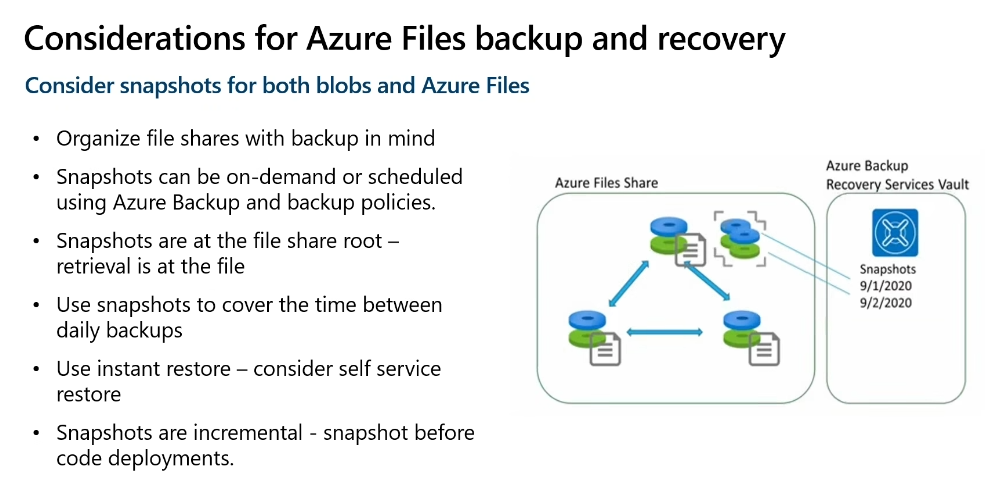

### Considerations for Azure Virtual Machines
Guard against unintended destruction of the data on your VMS

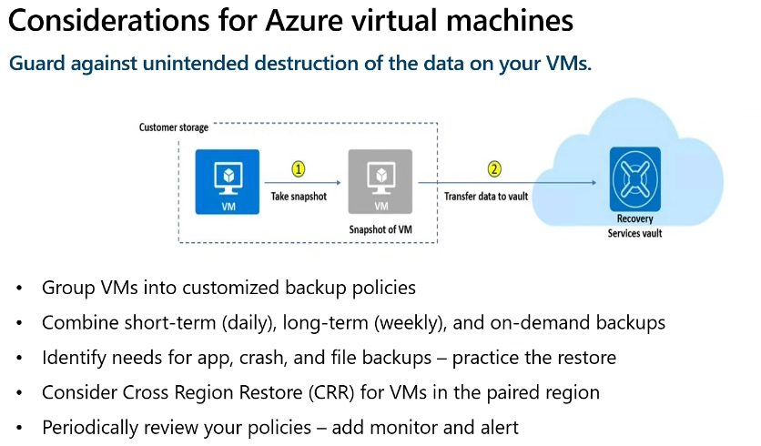

### How Azure SQL Backup Works
SQL Database and SQL Managed Instances automatically backup

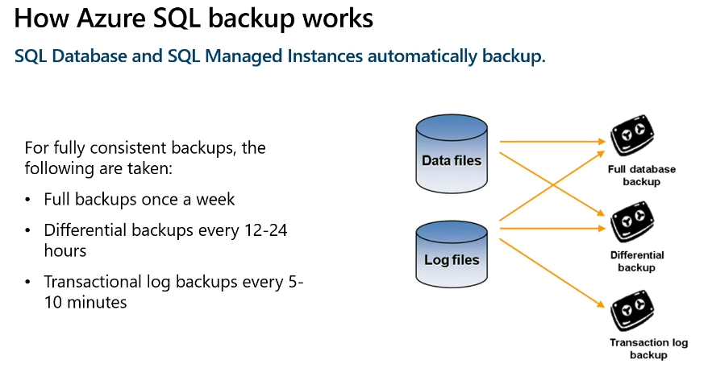

### Considerations For Azure SQL Backup
Restore in the retention period or use a long-term retention policy

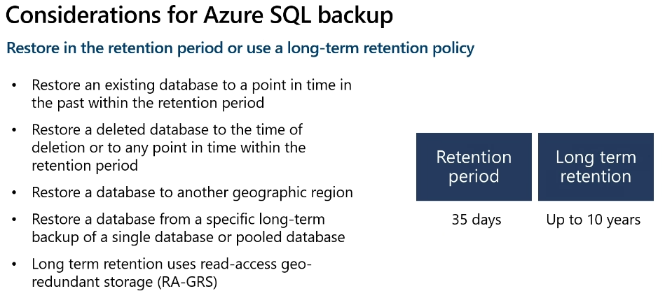

### When to use Azure Site Recovery
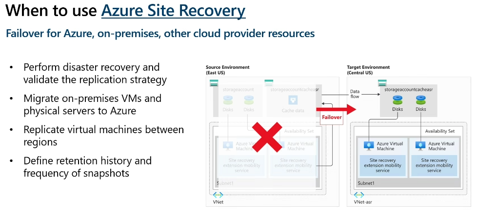

### Combine Azure Site Recovery with Azure Backup
Combine ASR with Azure Backup

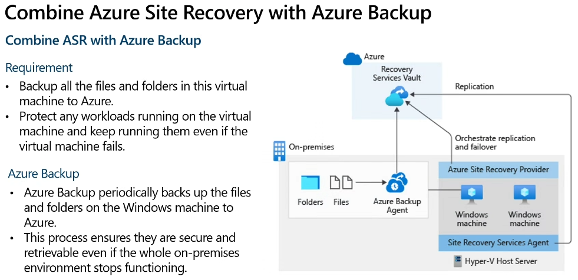

## Migrations
### Learning Objectives
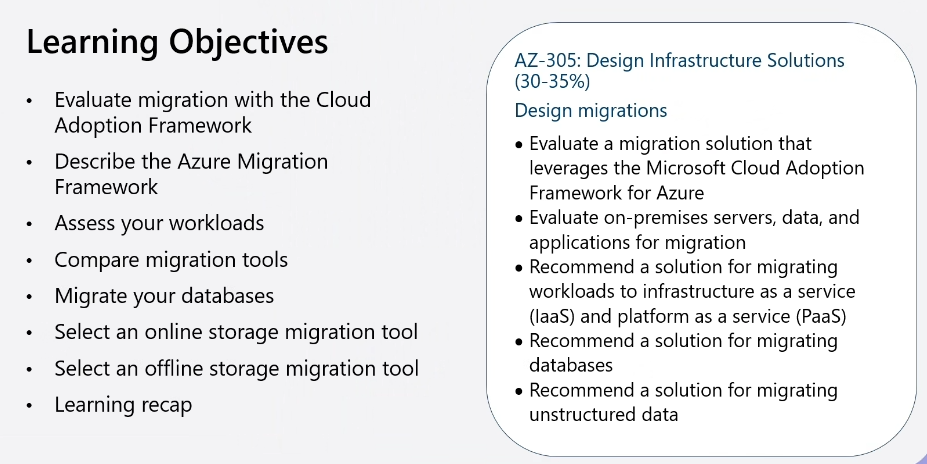

### Review the Cloud Adoption Frameworks
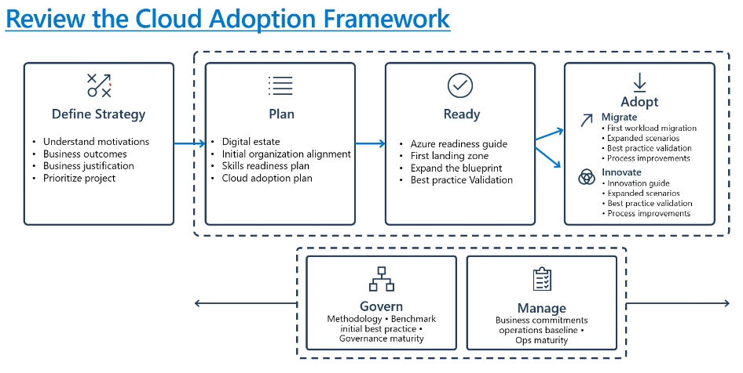

### Focus on Migration Efforts
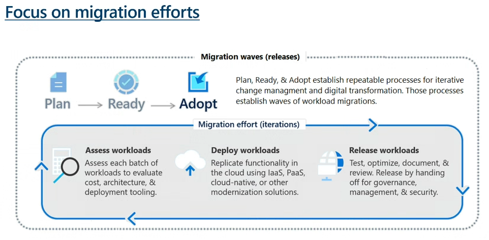

### Determine Your Migration Strategy
The 6 Rs:
- Rehost
- Refactor
- Rearchitect
- Rebuild
- Retire - Move workload and retire old application
- Replace - Replace with another offering (Example was using OpenOffice Replace with Office 365)

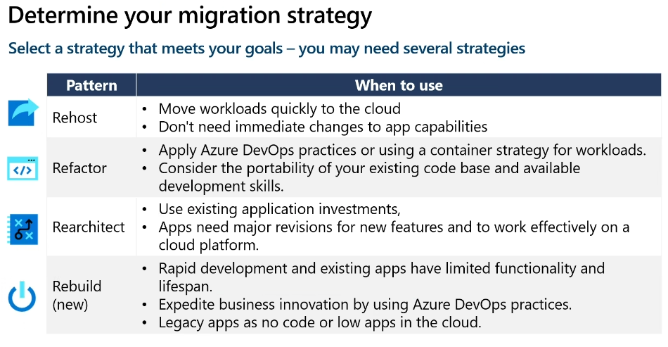

### Determine What to Migrate
Migrate and modernise all your mission-critical workloads to Azure

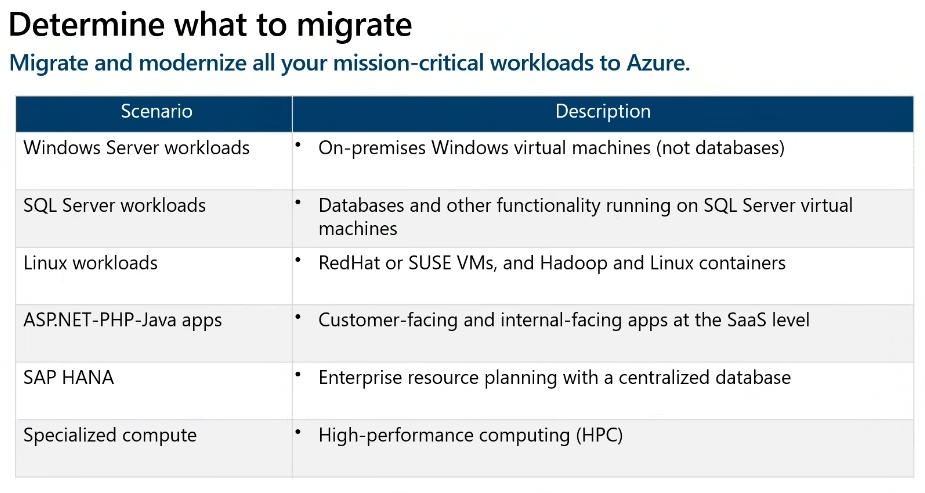

### Identify Migration Tools
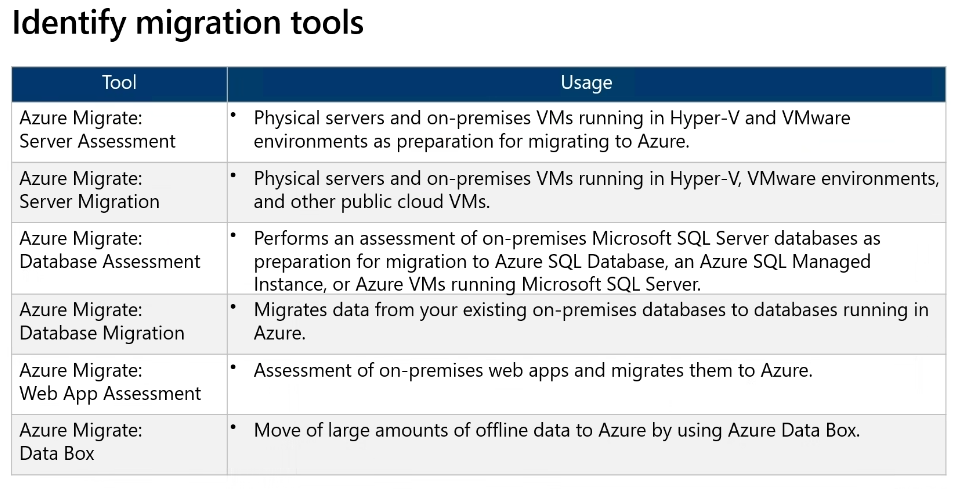

### Select Database Migration Type
Database migrations can be performed offline and online

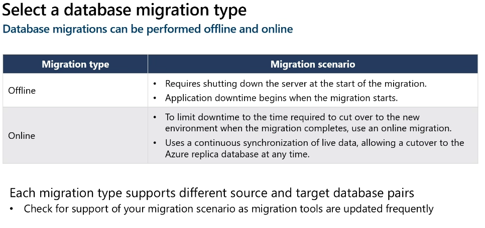

### Consider using Azure File Sync
Azure File Sync can be used specifically for migration
- Works in both hybrid and cloud migrations
- Transfer both the data stream and file metadata
- Combines with other products like Azure Data Box
- Support tiering options

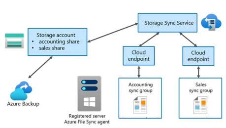

You need to open port 445 on the on-prem server for this to work. If this is not an option we can now use SMB over QUIC

[SMB over QUIC 📎](https://learn.microsoft.com/en-us/windows-server/storage/file-server/smb-over-quic?tabs=windows-admin-center%2Cwindows-admin-center1)

### Consider the Storage Migration Service
Storage Migration Service migrates storage to Windows Server or to Azure

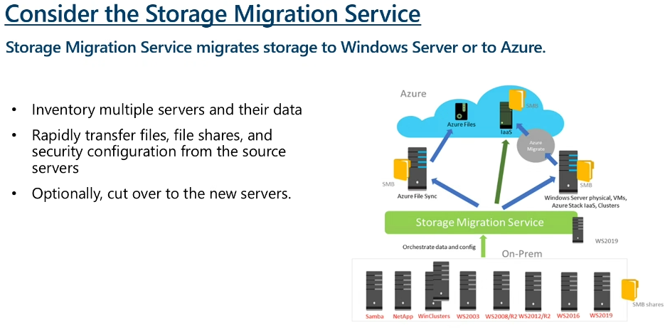

### Consider the Import/Export Service

[What is Azure Import/Export service? 📎](https://learn.microsoft.com/en-us/azure/import-export/storage-import-export-service)

### Consider the Data Box Family of Products
Data Box provides offline and online data transfer.

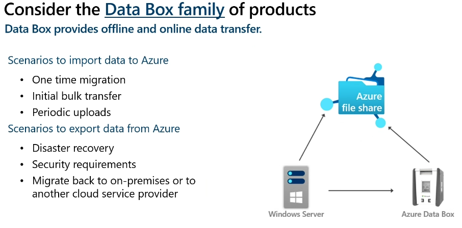

[Azure Data Box 📎](https://azure.microsoft.com/en-us/products/databox/)

### Compare Data Migration Solutions
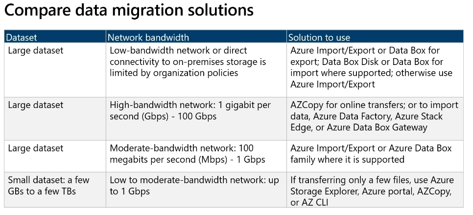